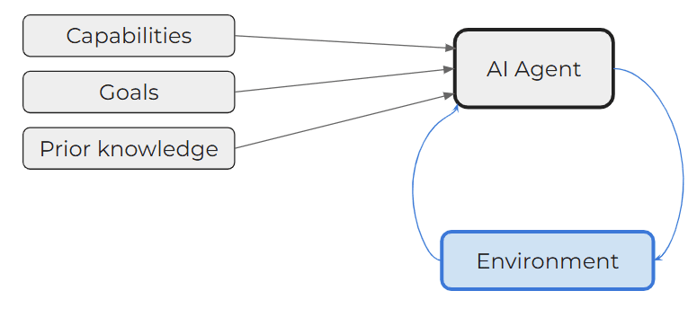
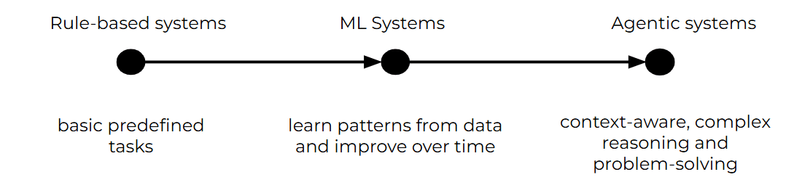

## **Welcome to Day 1 of our AI Agents journey!**

Today, we're diving into the basics: what exactly are AI Agents, and why should you care? Think of AI Agents as intelligent systems that can perceive their environment, reason about what they observe, and act autonomously to achieve specific goals. 

They don't just respond to commands; they proactively pursue tasks, adapt to changes, and streamline workflows--all without you lifting a finger.

Let's start with some key definitions to set the stage.

* **Artificial Intelligence (AI)**: AI is the broad field of computer science focused on creating machines capable of performing tasks that typically require human intelligence.

* **Machine Learning (ML)**: ML is a subset of AI involving algorithms and statistical models that enable computers to improve their performance on a task through experience.

* **Deep Learning**: Deep Learning is a subset of ML based on artificial neural networks, where algorithms learn from large amounts of data to identify patterns and make decisions.

* **Generative AI**: Generative AI refers to AI technologies that can generate new content, ideas, or data that are coherent and plausible, often resembling human-generated outputs.

* **Agents in AI:** In the context of AI, "agents" are entities capable of sensing their environment, making decisions, and taking actions. Unlike traditional programs that follow fixed instructions, agents operate more flexibly and autonomously, often adjusting their strategies as new information emerges.

### What Are AI Agents?

At its core, an AI agent is an intelligent system designed to perceive its environment, make decisions, and take actions to achieve specific goals. Unlike traditional software that follows rigid, predefined instructions, AI agents possess a remarkable ability to:

* Adapt to changing environments

* Learn from interactions and experiences

* Make autonomous decisions

* Solve complex problems with minimal human intervention

### The Evolution of AI Agents

The concept of AI agents isn't new, but recent technological advances have transformed them from theoretical constructs to powerful, practical tools:

1. **Early Stages**: Simple rule-based systems that could perform basic, predefined tasks

2. **Machine Learning Era**: Agents that could learn patterns and improve performance over time

3. **Current State**: Advanced, context-aware systems capable of complex reasoning and cross-domain problem-solving

### Why Are AI Agents So Powerful?

1. **Continuous Adaptation:** AI Agents can learn from new data and experiences, refining their strategies over time. This ongoing improvement enables them to handle changing environments and unforeseen challenges more effectively than static systems.

2. **Contextual Understanding:** By tapping into advanced models like LLMs and other foundation models, AI Agents develop a richer "understanding" of context. They interpret nuanced cues, making better-informed decisions that reflect current conditions.

3. **Task Automation at Scale:** From handling incoming emails to managing entire business processes, AI Agents can scale their operations with ease. Once you've set them up, you can deploy as many agents as you need, ensuring efficiency and responsiveness as your business grows.

4. **Strategic Decision-Making:** Beyond just following predefined rules, AI Agents can weigh trade-offs, predict outcomes, and prioritize actions - behaving more like strategic partners than passive tools.

### Today's Key Takeaway

AI agents represent a paradigm shift from traditional computing: they're not just tools we use, but intelligent partners that can learn, adapt, and solve problems alongside us.

[Next](02.md)