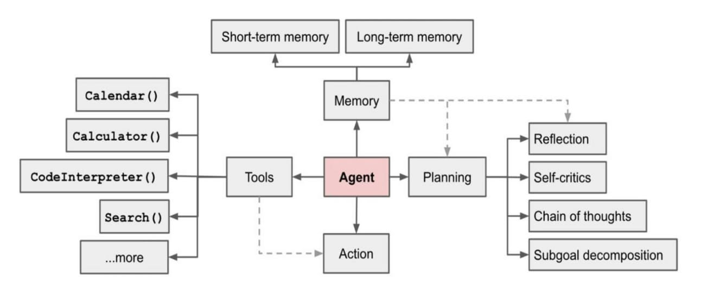

## Day 3: Components of an AI Agent Architecture

Hello again!

Welcome to Day 3 of our AI Agents journey! Yesterday, we explored various real-world use cases to understand the value AI Agents bring to businesses.

Today, we'll dig deeper into the "nuts and bolts" of how these agents actually work. At their core, most AI Agents share five fundamental building blocks: perception, reasoning, memory, planning, and action.

By understanding each component--and how they fit together--you'll gain a clearer picture of what makes AI Agents not just function, but thrive in complex environments.

#### 1. Perception

**What It Is:** Perception is the agent's ability to gather information about its environment. This could involve processing text queries, analyzing sensor data, interpreting images, or even reading structured data tables.
**Why It Matters:** The more effectively an agent can perceive, the richer the context it can understand. With stronger perception, agents can better adapt to changes and respond accurately to evolving conditions.

#### 2. Reasoning

**What It Is:** Reasoning is where the agent makes sense of the information it has perceived. This involves interpreting context, weighing different options, and forming logical conclusions.
**Why It Matters:** Reasoning underpins an agent's intelligence. It ensures the agent doesn't just react blindly but evaluates scenarios to make informed decisions. Advanced reasoning often involves leveraging large language models or other AI frameworks to understand the nuances of a given situation.

#### 3. Memory

**What It Is:** Memory is the agent's way of retaining relevant information over time. This can include short-term context (like the last user request) and long-term knowledge (like a database of past interactions or general industry expertise).
**Why It Matters:** Memory gives the agent a sense of continuity. Instead of treating each interaction as isolated, the agent can build upon previous experiences, improving its accuracy and context-awareness as it goes.

#### 4. Planning

**What It Is:** Planning is where the agent decides what steps to take to achieve its goals. It might break down complex tasks into simpler steps, sequence them in an optimal order, and anticipate potential roadblocks.
**Why It Matters:** Planning ensures that the agent isn't just reacting to one request at a time, but proactively charting a path towards longer-term objectives. This is crucial for tasks like supply chain optimization, project management, or any scenario where actions taken now have future implications.

#### 5. Action

**What It Is:** Finally, action is the actual execution of the agent's decisions--sending an email, adjusting inventory levels, recommending a product, or performing a system-level operation.
**Why It Matters:** Without action, all the perception, reasoning, memory, and planning in the world would be wasted. Action closes the loop and allows the agent to have a tangible impact on its environment, delivering real-world results.

### **How They Work Together**

* **Perception** feeds the agent with data.

* **Memory** stores and recalls useful information from both the immediate and distant past.

* **Reasoning** uses that data and context to form a plan.

* **Planning** maps out the steps needed to achieve the agent's goals.

* **Action** executes on those steps, creating measurable value.

### Components of an AI Agent Architecture

The technical architecture consists of four key components, each serving a distinct purpose in shaping the agent's behavior.

**1. Agent Core:** The central processing unit that integrates all functionalities.

**2. Memory Module:** Stores and retrieves information to maintain context and continuity over time.

**3. Tools:** External resources and APIs the agent can use to perform specific tasks.

**4. Planning Module:** Analyzes problems and devises strategies to solve them.

Each component reinforces the others. Better perception leads to better reasoning. Richer memory improves planning. And effective action provides new data that feeds back into perception and reasoning cycles. When these elements work in harmony, you get an AI Agent that is more than a sum of its parts--an autonomous, context-aware system capable of delivering meaningful outcomes.
