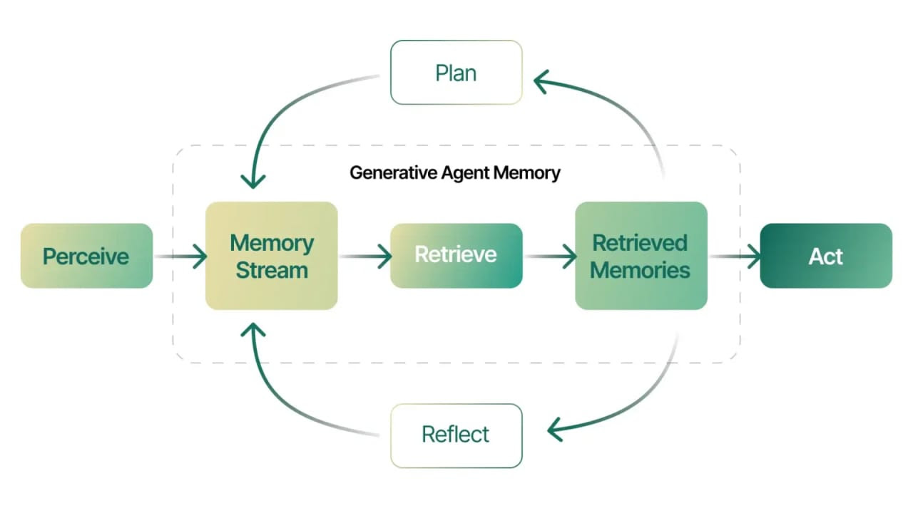

## Day 6: Memory and Context Management

Hello again,

Welcome to Day 6 of our AI Agents journey! We've covered what AI Agents are, how they integrate with LLMs, and how reasoning and function calling enhance their capabilities. Today, we turn our attention to one of the most critical aspects of building truly effective agents: **Memory and Context Management**.

While it's tempting to think of agents as "one-and-done" responders, the real power comes from their ability to remember past interactions, understand long-term objectives, and adapt to changing conditions. By getting memory right, you'll create agents that feel more coherent, purposeful, and valuable to users over time.

> "The main function of memory is to predict the future."  Miguel Nicolelis

### Why Memory Matters

**Contextual Understanding Over Time:**
Without memory, your agent would treat every interaction as a blank slate. Memory ensures that the agent can recall what was said or done previously, enabling richer, more intuitive conversations. For example, a support agent can remember that a user's last question was about shipping status, streamlining the next interaction rather than asking for the same details again.

**Building Trust and Reliability:**
When an agent shows that it "remembers" your preferences=E2=80=94whether it's a product category you favor or a specific workflow you run repeatedly=E2=80=94it builds trust. Over time, users feel more comfortable relying on the agent, knowing it's not just a momentary convenience but a long-term, reliable assistant.

**Adaptability and Personalization:**
Memory allows agents to adapt their behavior based on accumulated knowledge. By tracking user history, previous answers, or past decisions, agents can refine their approach, personalize recommendations, and proactively address potential issues before they arise.

### Techniques for Effective Memory Management

1. **Short-Term vs. Long-Term Memory:**

* **Short-Term (Session) Memory:** Tracks recent queries, user intents, and context within the current session.

* **Long-Term Memory:** Stores historical data, user preferences, and domain knowledge that persists across sessions and reboots, ensuring continuity over days, weeks, or months.

2. **Vector Databases and Semantic Search:**
By converting text data into vector embeddings, agents can quickly search through large knowledge bases for relevant information. This semantic search capability helps the agent find the most contextually similar data points, supporting more nuanced and accurate responses.

3. **Chunking and Context Windows:**
For large inputs (like long documents or conversation histories), agents often break the data into smaller "chunks." This approach ensures that the agent can handle complex inputs without getting lost, enabling it to zero in on the most relevant pieces of information.

4. **Metadata and Tagging:**
Storing metadata=E2=80=94like timestamps, user IDs, or categories=E2=80=94helps the agent quickly filter what it needs. Instead of sifting through all past data, the agent can jump straight to relevant tags, speeding up retrieval and reducing the risk of inaccurate or stale information.

5. **Retrieval-Augmented Generation (RAG):**
RAG techniques involve querying a knowledge store for relevant context before the agent formulates its response. This ensures that the agent's output is always grounded in the most up-to-date, accurate information, making it more reliable and consistent.

### The Role of Frameworks and Tools

Modern AI frameworks and agent-building tools are designed to handle these memory techniques seamlessly. They often offer built-in integrations with vector databases, simple interfaces for tagging and metadata management, and out-of-the-box support for retrieval-augmented generation. By using these tools, you don't have to reinvent the wheel - your developers and non-technical team members can focus on improving the user experience and strategic outcomes, instead of wrestling with the complexities of memory management.