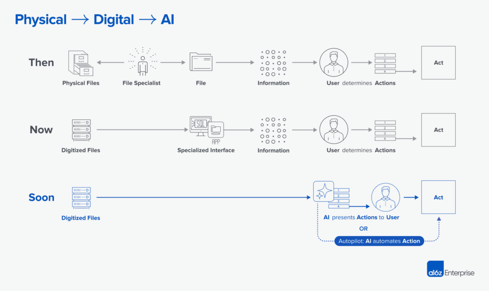

## Day 9: Ethical and Responsible Agent Deployment

Welcome to Day 9 of our AI Agents journey! So far, we've explored what AI Agents are, the architectures that empower them, how to integrate LLMs, and the skill sets that shape their development. Today, we'll address a crucial dimension of deploying AI Agents: ensuring that their creation, implementation, and maintenance uphold ethical, responsible standards.

> The potential market of AI agents is not in the billions of dollars, but the trillions
> Marc Benioff, CEO and Founder of Salesforce

As these systems become integral to everything from customer service to critical medical decisions, it's no longer enough just to build powerful agents. We must consider how they impact people's lives, maintain privacy, and treat all users fairly.

------------------------------------------------------

### Why Ethics in AI Agent Deployment Matters

As AI Agents increasingly influence decision-making and interact with people across industries, addressing their ethical implications is critical to ensuring positive, long-term societal impact.

**Public Trust and Reputation:**
A company that implements AI Agents without considering ethical implications risks eroding customer trust. Transparent, responsible AI practices foster long-term credibility and protect your brand from reputational damage.

**Regulatory Compliance:**
Regulations around data protection, fairness, and accountability are on the rise. Responsible agent deployment means staying ahead of compliance requirements, avoiding hefty fines, and setting industry standards rather than reacting to them.

**Sustainable Innovation:**
Ethical considerations help guide innovation toward solutions that genuinely improve lives. By prioritizing equity, privacy, and transparency, you create AI agents that enrich human experiences rather than commodifying or exploiting them.

------------------------------------------------------

### AI Will Turn Capital into Labor

The rise of AI Agents isn't just a technological evolution--it's an economic revolution. The global AI Agent market is projected to grow exponentially, with estimates suggesting a multi-trillion-dollar opportunity by 2030. This includes applications in customer service, healthcare, logistics, education, and beyond. Businesses are already seeing transformative value, from automating repetitive tasks to enabling entirely new business models.

> AI Agents Market worth $47.1 billion by 2030
> -- by MarketsandMarkets

**Will AI Take Over All Jobs?**
While there's concern about automation replacing human roles, history shows that technological revolutions tend to create as many opportunities as they displace. AI Agents will likely take over repetitive, predictable tasks--but this opens doors for humans to focus on creativity, strategy, and problem-solving. The key lies in adaptation: learning to work alongside AI rather than fearing it.

**Opportunities in the AI Agent Ecosystem:**

AI Agents are reshaping industries by increasing efficiency, replacing repetitive labor, and unlocking new economic opportunities. Traditionally "small" markets, often overlooked due to limited software spend or customer base, are now becoming viable targets as AI-driven tools replace human labor, increase customer lifetime value (LTV), and reduce customer acquisition costs (CAC).

Here are some examples from a16z

* **Drycleaning and Laundry Services:** With 18,000 laundromats spending $2.7 billion annually on labor, AI Agents could streamline operations and automate manual processes, reducing costs and increasing profitability.

* **Chiropractic Offices:** These 38,000 firms employ 140,000 people and spend $4.5 billion on labor. AI Agents could optimize scheduling, patient communication, and billing, driving higher efficiency.

* **Veterinary Services:** In a $13.8 billion labor market employing 356,000 workers, AI Agents could handle tasks like appointment management and medical record-keeping, freeing professionals to focus on patient care.

The growth of AI Agents represents not just a shift in how we work but a massive opportunity for innovation, entrepreneurship, and job creation in AI's surrounding ecosystem.

------------------------------------------------------

### Key Ethical Considerations

It is imperative that organizations can build trust and create agents that deliver long-term, sustainable value. The technology needs to align with societal values and do more good than harm. These are key consideration of any AI Agentic system:

1. **Privacy and Data Governance:**
Agents often handle sensitive data--from personal financial info to healthcare records. Ensuring that this data is securely stored, anonymized where possible, and accessed only on a need-to-know basis is critical. Robust encryption, regular audits, and strict data minimization policies help maintain user trust and comply with privacy regulations like GDPR or HIPAA.

2. **Fairness and Bias Mitigation:**
AI Agents trained on biased datasets can unintentionally discriminate. Whether it's a recruiting agent favoring certain backgrounds or a loan-approval agent showing patterns of unfair lending, these outcomes can harm individuals and expose organizations to legal and ethical scrutiny. Regular bias audits, inclusive training data, and ongoing monitoring help ensure that agents treat all users equitably.

3. **Accountability and Explainability:**
When an AI Agent makes a recommendation or takes an action, who is responsible for the outcome? Implementing transparency into decision-making processes--such as explainable AI techniques or clear escalation protocols--helps users understand how conclusions were reached and ensures that accountability remains with human overseers rather than being offloaded onto =E2=80=9Cthe machine.=E2=80=9D

4. **Safety and Reliability:**
Agents deployed in high-stakes domains--like healthcare diagnostics or autonomous finance management--must meet rigorous safety standards. This involves stress-testing agents in simulated environments, implementing fallback mechanisms to human experts, and continuously evaluating performance metrics to prevent harmful errors.

------------------------------------------------------

### Balancing Innovation with Responsibility

Ethical considerations aren't about stifling progress. In fact, embracing responsible practices enhances long-term innovation by building user confidence and mitigating risks.=20

By viewing ethics as a guiding principle--rather than an afterthought--you'll create AI Agents that are efficient, cutting-edge but also trustworthy, inclusive, and beneficial to society.