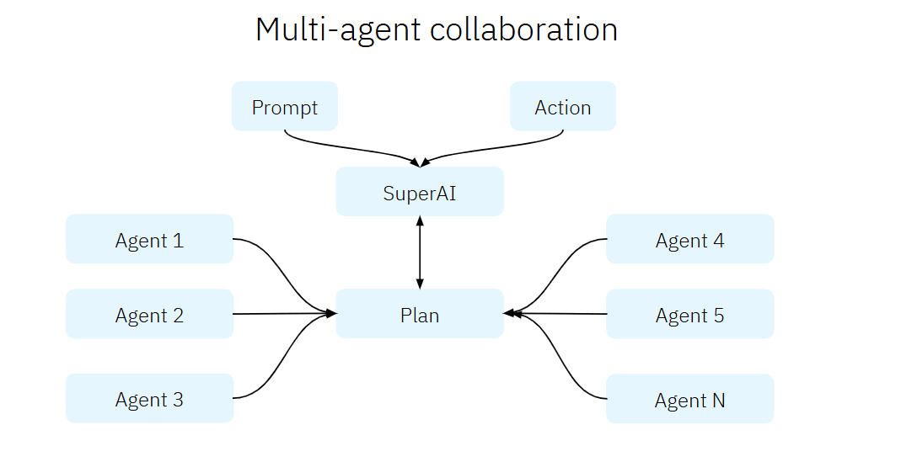
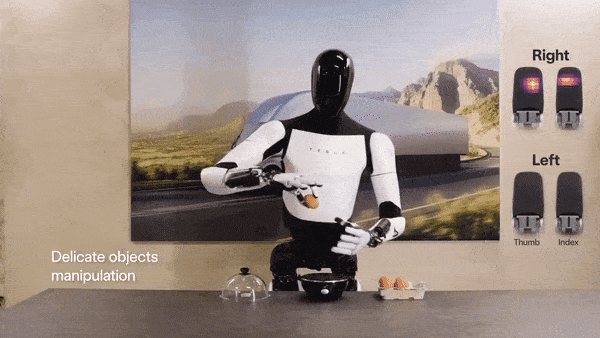
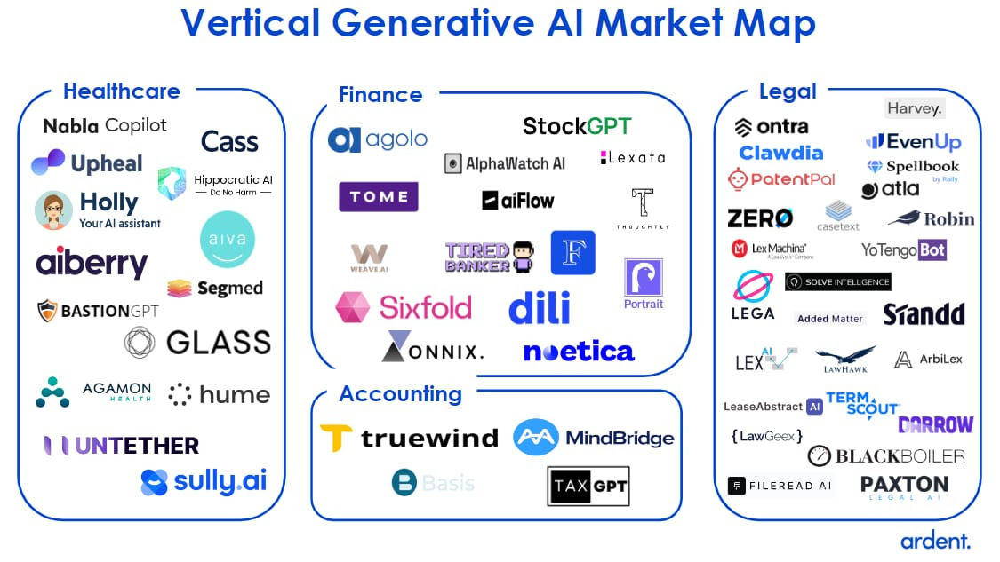

## Day 10 - The Future of AI Agents and Your Next Steps

Hello again,

Welcome to the final installment of our AI Agents 10-day journey! Over the past few days, we've explored the foundations, architectures, ethical considerations, and practical applications of AI Agents. Today, we'll take a forward-looking view of the field's most exciting trends and provide you with the resources and strategies to continue learning and innovating in this fast-moving domain.

These are my predictions:

**1. Autonomous Multi-Agent Systems:**
Agents will collaborate as interconnected networks, solving complex problems together, like optimizing supply chains or managing decentralized systems.

**2. Robots and Humanoids Powered by AI Agents:**
AI Agents will increasingly power robots and humanoids, enabling physical-world interactions in industries like healthcare, retail, and logistics.

**3. More Built-in Architecture and Complexity Within AI Models:**
Advanced AI models will integrate reasoning, memory, and planning directly, reducing the need for complex external frameworks.

**4. Deeper Integrations with Real-World Systems:**
Agents will seamlessly integrate with IoT, SaaS, and smart city ecosystems, enabling real-time data-driven actions.

**5. Specialization and Domain Expertise:**
Agents will become highly specialized, excelling in niche roles like healthcare compliance or financial analysis.

**6. Evolving Regulatory and Ethical Landscapes:**
As adoption grows, stricter regulations will demand transparency, fairness, and accountability in AI Agent deployments.

**7. Enhanced Human-Agent Collaboration:**
Agents will complement human roles, handling repetitive tasks while humans focus on creativity and strategy.

------------------------------------------------------

## Follow leaders in the AI space

These are some of the AI leaders I follow on Linkedin:

* ​ : Data Scientist | LinkedIn Top Voice Data & AI | EB1A Recipient | 460k+ Followers | Ex- Google, Ex-IBM

*  : AI Entrepreneur, Advisor, and Investor | 1MM+ followers | Former Amazon, IBM | LinkedIn Top Voice for AI 2019-2023

*  ​: AI scientist | YouTuber - 120K followers | Author of Grokking Machine Learning

*  ​: ML at TalentNeuron, author of  and the 
* 

## **Join Newsletters**

Don't fall behind on AI. These newsletters summarize the daily news so you get the latest AI trends and tools you need to know. I read them all every day.

* 

* 

* 

------------------------------------------------------