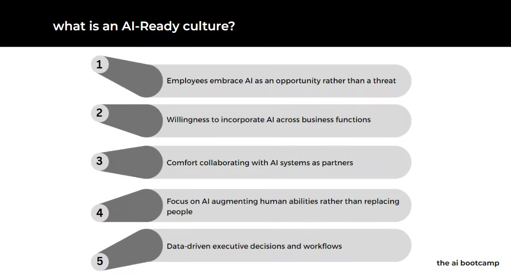
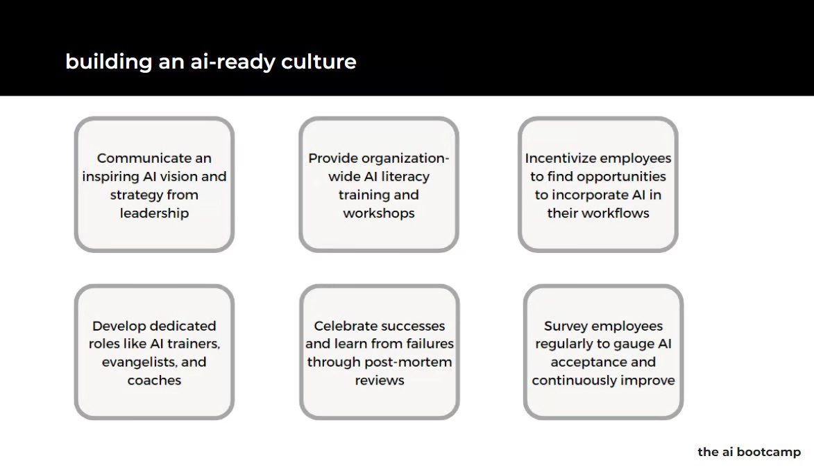
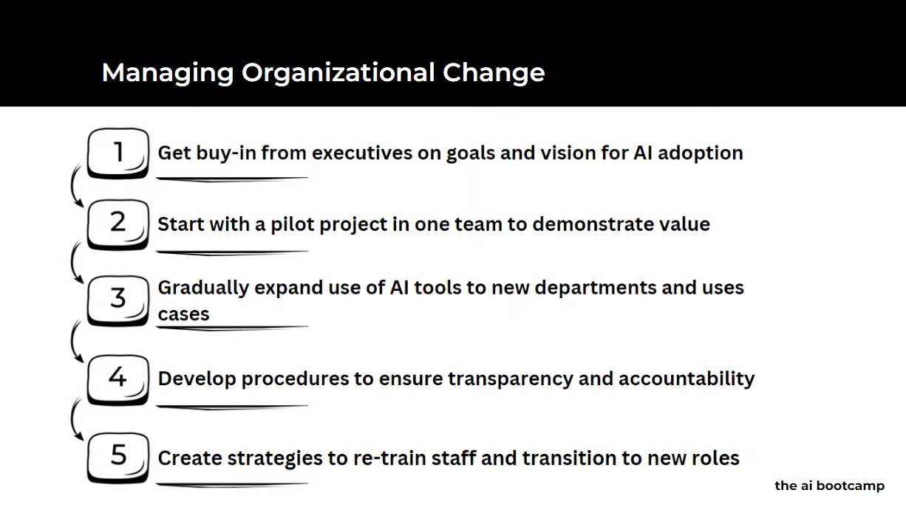
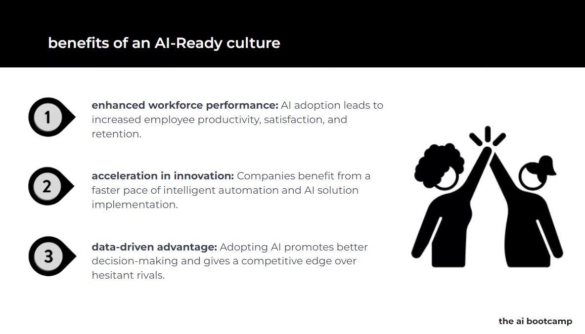

# Creating and AI-ready Culture

The rise of AI isn't science fiction anymore. It's disrupting industries, automating tasks, and reshaping the future of work. But a harsh reality bites - most companies aren't ready for this revolution. They're like sleepwalkers stumbling towards a cliff, oblivious to the impending fall.

**Don't be one of them.**

Instead, wake up, and take proactive steps to prepare your business for the AI wave. By investing in three key areas - culture, change management, and rapid innovation - you can not only survive but thrive in this new era.

Today I'll cover:
- What is an AI-ready culture?
- Why companies Need to change their Culture to achieve success with AI
- How to build an AI-ready culture
- Benefits of an AI-ready culture

Let’s Dive In! 🤿

## What is an AI-ready culture?
AI isn't just a technology; it's a fundamental shift in mindset. Ditch the fear and embrace the potential. Foster a culture of **curiosity, learning, and adaptation**. Encourage employees to experiment with AI tools, attend workshops, and ask questions. Remember, a skilled workforce, not just AI itself, is your true competitive advantage.

## Why companies Need to change their Culture to achieve success with AI

Don't wait for perfect solutions. Embrace agile methodologies and **experimentation** as your guiding principles. Create dedicated innovation labs, incentivize creative thinking, and reward calculated risks. Encourage collaboration between tech-savvy individuals and domain experts. Remember, **fast iteration, not stagnant perfection, is the key to AI success**.

Twelve months of sustained effort in these areas can make a world of difference. You'll foster a culture that welcomes AI, navigates change smoothly, and builds an environment where innovation thrives. The result? A future where your business isn't just surviving, but leading the charge in the AI revolution.

## How to build an AI-ready culture and manage change
AI integration isn't a magic bullet. Expect bumps along the road. Proactively manage organizational change by being transparent, communicating effectively, and addressing employee concerns. Train your workforce on new skills, invest in reskilling programs, and offer support throughout the transition. Remember, happy and empowered employees are your biggest AI allies.

Building an AI-ready culture isn't an overnight sprint, it's a marathon. Here are some steps to get you started:

- **Leadership buy-in**: Secure support from top management to advocate for and champion AI initiatives.
- **Communication and education**: Educate employees about AI, its potential benefits, and how it will impact their roles. Address concerns openly and honestly.
- **Invest in training and development**: Equip employees with the skills needed to work with AI, including data literacy, critical thinking, and problem-solving.
- **Empowerment and experimentation**: Encourage employees to experiment with AI tools and suggest potential applications. Celebrate successes and learn from failures.
- **Create a feedback loop**: Gather feedback from employees on their experiences with AI and use it to continuously improve your approach.

## Benefits of an AI-ready culture
The benefits of fostering an AI-ready culture extend far beyond simply implementing AI tools. It can lead to:

- **Increased innovation**: A culture that encourages experimentation and embraces new ideas fosters a breeding ground for innovative AI solutions.
- **Improved decision-making**: Data-driven decisions based on AI insights can lead to better business outcomes.
- **Enhanced productivity**: AI can automate routine tasks, freeing up employees to focus on more strategic and creative work.
- **Stronger employee engagement**: When employees feel empowered and involved in AI initiatives, they're more likely to be engaged and motivated.
- **Attract and retain top talent**: A forward-thinking culture that embraces AI is attractive to the best and brightest minds.

## Still hesitant? Consider this:
- Your competitors are likely making moves. Don't let them gain an insurmountable advantage.
- AI can unlock immense value. From smarter operations to personalized customer experiences, the benefits are real.
- Ignoring AI won't make it go away. It's time to embrace the future, not run from it.

Remember, the choice is yours. Sleepwalk into oblivion or step boldly into the exciting, AI-powered future. The clock is ticking - will you answer the call?
