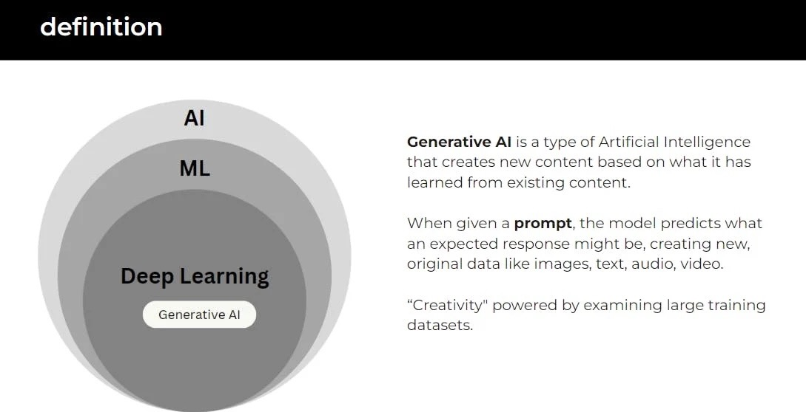

# Introduction

## Definition

- Artificial Intelligence (AI): AI is the broad field of computer science focused on creating machines capable of performing tasks that typically require human intelligence.
- Machine Learning (ML): ML is a subset of AI involving algorithms and statistical models that enable computers to improve their performance on a task through experience.
- Deep Learning: Deep Learning is a subset of ML based on artificial neural networks, where algorithms learn from large amounts of data to identify patterns and make decisions.
- Generative AI: Generative AI refers to AI technologies that can generate new content, ideas, or data that are coherent and plausible, often resembling human-generated outputs.
​
## What powers Generative AI

Foundation models are large-scale artificial intelligence models that have been trained on vast amounts of data. These models are highly versatile and can be adapted to a wide range of tasks and applications.

Generative AI is one of the applications of foundation models. It involves using these models to create new content, such as text, images, or music. The foundation model serves as the underlying structure that understands and processes information, enabling the generative AI to produce new, coherent, and relevant outputs.

In simple terms, foundation models are like the core engine, and generative AI is one of the many things that this engine can power.

## What makes Foundation Models so powerful?
- Pretrained: The model has already been trained on a vast dataset before being fine-tuned or applied to specific tasks.
- Generalized: The model is capable of performing well across a wide range of tasks, not just the ones it was - specifically trained for.
- Adaptable: The model can be easily modified or fine-tuned to suit particular needs or tasks.
- Large: The model is built with a substantial architecture and trained on extensive data, giving it a broad understanding and capability.
- Self-supervised: The model primarily learns by analyzing and making sense of unlabeled data, without explicit guidance on what to learn.

## What are Large Language Models?
Large Language Models (LLMs) are a type of foundation model specifically designed to understand and generate text. They're trained on huge amounts of text, which makes them good at a wide range of language tasks. LLMs are part of the broader category of foundation models, meaning they're versatile and can be adapted for different uses involving language.

[Next](./02-genai-types.md)