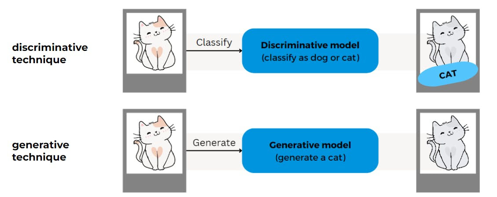
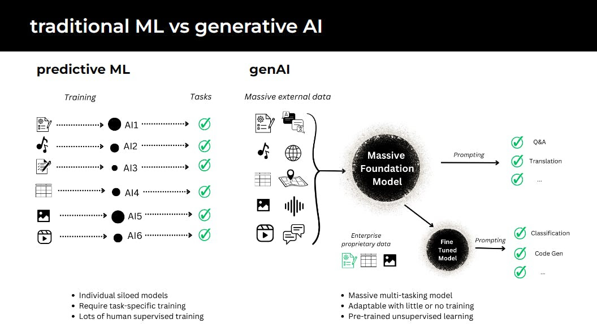
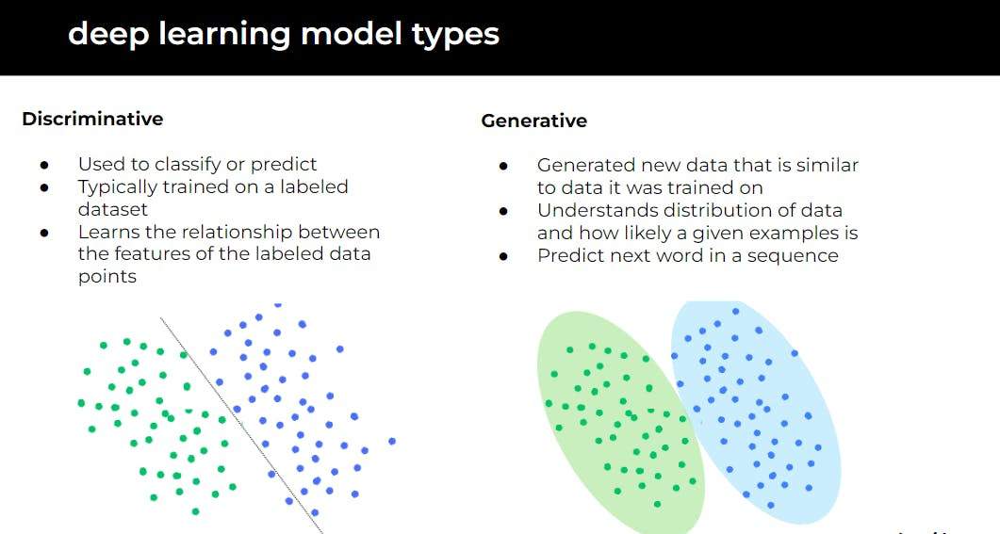

# Traditional Machine Learning

Discriminative models in Traditional ML are designed to classify or predict outcomes based on input data. They focus on drawing boundaries between different categories and making decisions.

- **Application Examples**: Predictive analytics in business forecasting, spam filters in email systems, and recommendation systems in streaming services.
- **Key Characteristics**:
  - **Supervised Learning**: Often relies on labeled data sets to train models. Labeling data is very expensive and time-consuming.
  - **Predictive Accuracy**: Emphasizes the accuracy of predictions based on known data.
  - **Analytical Approach**: Aims to understand data and draw conclusions.

## Generative AI

In contrast, Generative AI doesn’t just analyze data; it creates new data that didn’t exist before. It's about innovation and creation, generating new content that is similar to but distinct from the training data.

- Application Examples: Creating new images or artwork, generating realistic human-like text, or composing music.
- Key Characteristics:
  - Creative Output: Produces new content, extending beyond analysis.
  - Model Types: Uses models like GANs (Generative Adversarial Networks) and VAEs (Variational Autoencoders) for content generation.
  - Innovation Focused: Pushes the boundaries of what machines can create.

## The Role of Discriminative vs Generative in AI

The distinction between discriminative and generative models is vital. Discriminative models excel in classification and prediction tasks, making them suitable for analytical applications. In contrast, generative models are unparalleled in their ability to create and innovate, making them ideal for tasks requiring new content generation.

Understanding whether your business needs to analyze and classify existing data or generate new, unseen content will guide you in choosing the right AI approach.

[Next](./04-gpu.md)