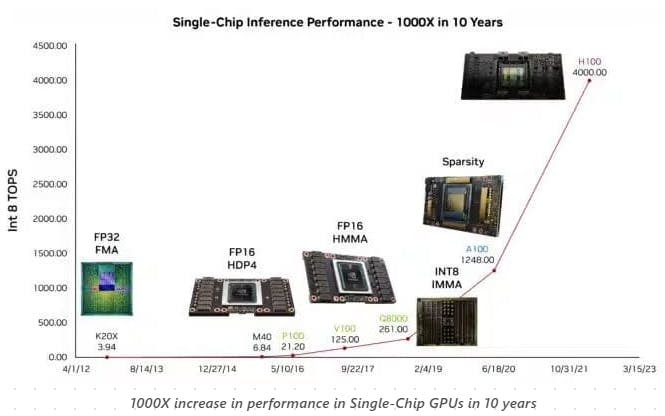
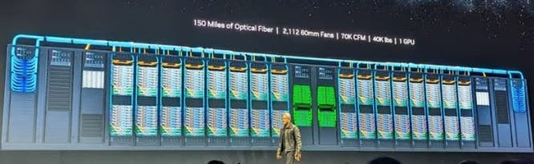

# Demystifying GPUs in AI

## What are GPUs?

GPUs, or Graphics Processing Units, were initially designed for rendering graphics and video tasks. Remember the excitement of upgrading your PC with a new GPU for better gaming? That same technology has become pivotal in AI, thanks to its architecture and parallel processing capabilities.

Why are GPUs Crucial for AI?

- GPU Architecture: GPUs have thousands of small cores (organized into Streaming Multiprocessors) designed for parallel computing. This setup is perfect for AI workloads, which often require simultaneous processing of large data sets.
- Parallel Processing Power: GPUs excel at performing multiple calculations at once, making them ideal for handling the complex mathematical operations needed in AI.
- Speed and Efficiency: With rapid thread switching and high memory latency tolerance, GPUs significantly reduce the time needed for training neural networks, like GPT-3, which requires 300 zettaflops of computing power.
- AI Framework Support: Manufacturers like Nvidia, AMD, and Intel have optimized GPUs for AI frameworks such as TensorFlow and PyTorch.

## The Rise of AI Supercomputers

AI research has skyrocketed with the advent of AI supercomputers, clusters of GPUs working together. These supercomputers, like Summit, Sierra, and Fugaku, are pushing the boundaries in fields like scientific research and climate modeling.

## Selecting the Right GPU

Choosing the appropriate GPU involves understanding your needs - whether it's for AI training, inference, or both, and balancing factors like budget, performance, compatibility, and scalability.

## The Future of GPUs in AI

We're witnessing a 1000X increase in single-chip GPU performance over the last decade. The future holds more specialized AI chips, quantum computing advancements, and edge AI integrations, further transforming the AI landscape.

In **Conclusion**, GPUs have transitioned from enhancing our gaming experiences to becoming the backbone of AI, fueling advancements in machine learning and beyond. Their role in accelerating AI workloads is indisputable and will continue to shape the future of technology.

[Next](./05-train-fm.md)