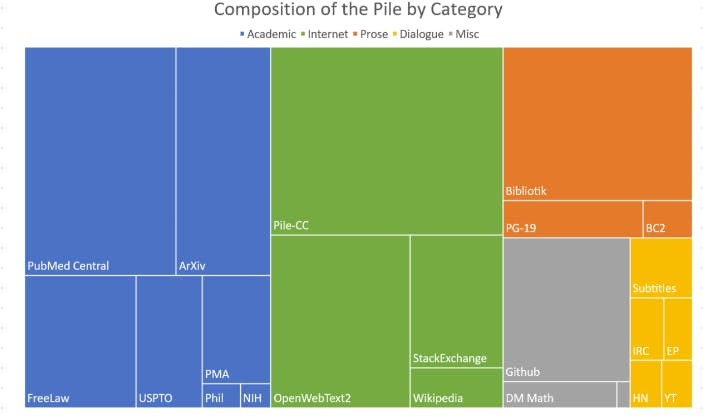
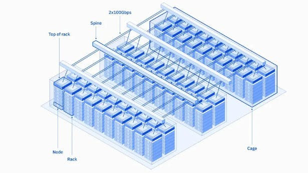

# What it Takes to Train a Foundation Model

The reasons why training your foundation model can be a pivotal step for your business but it is a decision that has to be taken very wisely.

**Control Over the Model**

- Tailored Approach: When you train your model, you control the data and parameters, allowing you to tailor it to specific styles or domains. This customization ensures the model aligns perfectly with your business needs.

**Improved Performance**

- State-of-the-Art Results: Foundation models trained on large, diverse datasets can outperform pre-trained models, especially if your dataset is domain-specific.

**Customization**

- Modifying Architecture: Building your own model means you can alter aspects like tokenizer, vocabulary size, or model architecture, which might be necessary if these components are central to your business strategy.

**Challenges of Training from Scratch**

- Data Collection: Amassing a large, relevant dataset is crucial. An example is The Pile, an extensive, diverse language modeling dataset.

- Compute Resources: Significant computational power is needed, as demonstrated by AI supercomputers, equipped with thousands of Nvidia A100 and H100 GPUs.

- Expertise: Specialized knowledge in AI and ML is essential due to the complexity of model architecture and training processes.

*OpenAl is setting new industry standards with its engineers earning an average annual salary of $925,000! This includes a base salary of $300,000 and a whopping $625,000 in stock-based compensation.
Some even earn as much as $1.4 million! #Al #OpenAl #TechNews*

## Training Steps

1. Dataset Collection: Gather a large, diverse dataset relevant to your tasks.
2. Preparation and Tokenization: Clean and format your data, breaking down text into tokens.
3. Configure Training: Set hyperparameters, choose the architecture, and allocate computational resources.
4. Training: Train your model using deep learning algorithms.
5. Evaluation: Test the model's performance on a separate dataset.
6. Deployment: Once satisfied, deploy the model for practical use.

## Cost Considerations

Training a foundation model can range from tens of thousands to millions of dollars, depending on the model size, data volume, and computational resources.

## Recommendation for Businesses

- Customize a Pre-Trained Model: Starting with a pre-trained model and customizing it with techniques like Parameter Efficient Fine Tuning (PEFT) can save time and resources.
- Consider Needs and Resources: Evaluate your specific needs and available resources to decide between purchasing, training, or customizing a model.

Customizing foundation models is a great way to get the most out of these powerful tools. It is less expensive, faster, and can give you better performance than training a model from scratch.

In conclusion, while training a foundation model is resource-intensive, it offers unparalleled control and performance, essential for businesses aiming to develop a strong technological edge in AI.

[Next](./06-customize-fm.md)