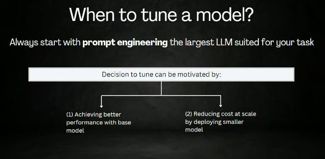
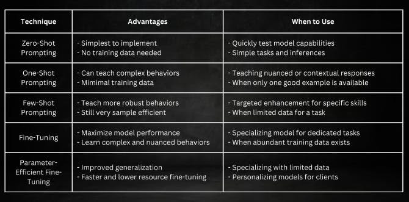

# How to customize foundation models

The secrets of customizing foundation models to suit your specific needs. Understanding when and how to tune these models is crucial for optimal performance.

## Deciding When to Tune Your Model

**Starting Point**: Begin with prompt engineering using the largest suitable Language Model (LLM) for your task to gauge if LLMs can handle it. Experiment with various prompt formats and examples.

## Prompting Techniques

1. Zero-Shot Prompting:
  - Efficiency with No Extra Data: This involves giving a natural language prompt to generate desired outputs without additional training data.
  - Example: "Provide a summary of the following passage: [insert text]."

2. One-Shot Prompting:
  - A Single Example to Guide: Introduce one example along with your prompt to demonstrate the desired outcome.
  - Example: "Write marketing copy for WorkoutFuel protein shakes in an enthusiastic, punchy voice," along with a high-energy example text.

3. Few-Shot Prompting:
  - Leveraging a Few Examples: Provide a handful of examples to establish the pattern or style for the model to replicate.
  - Example: To generate meeting summaries, give 2-3 examples before asking the model to create new ones.

## Data-Driven Tuning for Deeper Customization

- Fine-Tuning: Adjusting model weights on a specific dataset to cater to your unique objectives, like customizing tone or addressing complex prompts.
- Parameter-Efficient Fine-Tuning (PEFT): Delta tuning updates only a small subset of parameters, offering a faster, cost-effective alternative to traditional fine-tuning.

**PEFT Techniques**:

 - Parameter-Efficient Fine-Tuning (PEFT) is a more cost-effective and efficient method because it focuses on optimizing a small subset of model parameters, reducing computational resources and training time while maintaining high-performance levels. There are multiple techniques:
- Prefix Tuning: Attaches vectors with free parameters to input embeddings, training them while keeping the LLM frozen.
- Prompt Tuning: A simpler variant of prefix tuning, adding a vector only at the input layer.
- P-Tuning: Automates the search and optimization of prompts using an LSTM model.
LoRA: Low-Rank Adaptation adds update matrices to existing weights, training these new weights.

## Choosing the Right Technique:

- Goal-Oriented Approach: Select the customization method based on your specific goals and the data you have. For instance, zero-shot and few-shot prompting work well with minimal data, while data-driven tuning is ideal for more complex, data-rich tasks.

Customizing foundation models can significantly enhance their performance on specific tasks, making them more aligned with your business objectives.

[Next](./07-popular-llm.md)