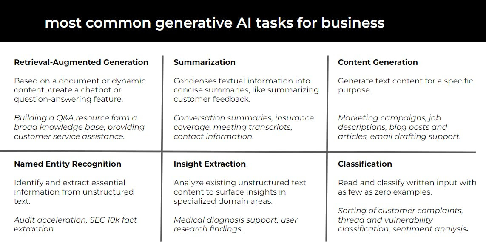

# Generative AI Applications and Use Cases

The transformative applications of generative AI in business, examining how these technologies are reshaping various industries and enterprise functions.

## Broad Spectrum of Business Applications:

- Marketing and Advertising: From crafting compelling ad copy to generating creative landing pages, generative AI is revolutionizing how businesses approach marketing.
- Content Creation: AI is now capable of producing news articles and social media content, enhancing digital presence with minimal effort.
- Customer Service: By deploying AI-driven chatbots, businesses can ensure engaging, natural conversations with customers, elevating the service experience.
- Summarization: Generative AI can distill lengthy reports and papers into concise, informative summaries, aiding decision-making and research.
- Data Analysis: AI tools can sift through vast datasets, uncovering patterns and insights that drive strategic decisions.
- Personalization: Tailoring content to individual user preferences or customer segments is now more efficient with AI's generative capabilities.
- Product Development: Rapid prototyping and testing of new product designs are made possible, speeding up the innovation process.

## Key Benefits for Businesses:

- Increased Efficiency: Automate repetitive content generation tasks, freeing up valuable time for strategic work.
- Cost Savings: Reduce reliance on expensive human labor, particularly in creative and writing tasks.
Consistency and Quality: Maintain a consistent brand voice while leveraging AI's analytical capabilities to produce high-quality content.
- Faster Ideation and Scalability: Accelerate the process of brainstorming and content production, enabling businesses to reach larger audiences more effectively.

See my detailed list of Use Cases in this recent LinkedIn post. Here's the [link](https://www.linkedin.com/posts/armand-ruiz_ai-is-not-hype-at-ibm-weve-completed-1000-activity-7130888264483295232-y9uc/?utm_source=share&utm_medium=member_desktop)​

**Transforming Enterprise Operations**: Generative AI is not just a tool; it’s a **game-changer** for business operations. It enables businesses to scale creativity, streamline content creation, engage customers in novel ways, and achieve significant time and cost savings. The integration of AI into these functions is transforming how businesses interact with their customers, manage their internal processes, and innovate in their product offerings.

Incorporating generative AI into business strategies can lead to more efficient, creative, and data-driven approaches, opening new avenues for growth and competitive advantage.

[Next](./09-genai-stack.md)