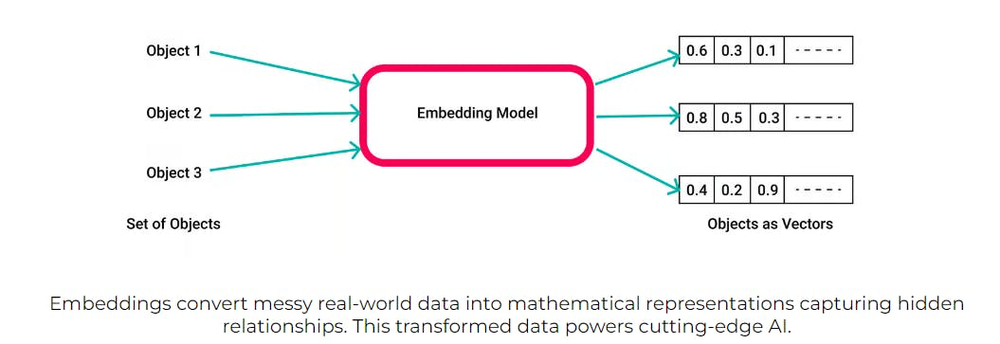
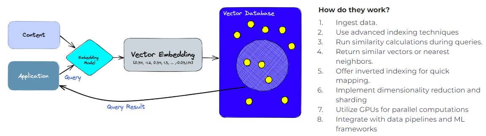
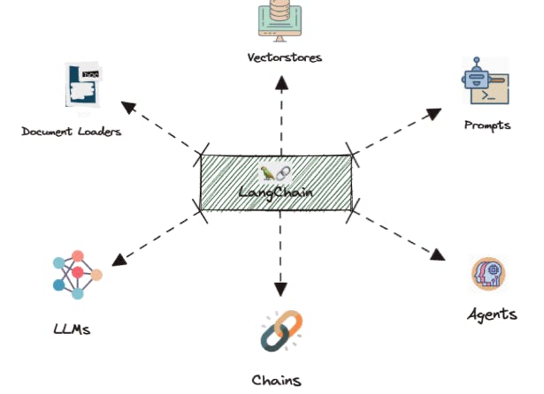
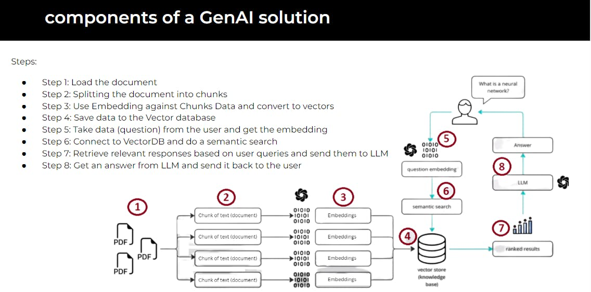

# The Generative AI Application Development Stack

Welcome to Day 9! Today, we're diving into the architecture of the Generative AI (GenAI) stack, crucial for crafting customized GenAI applications.

## The GenAI Stack: A Modular, Integrated System

Understanding the GenAI Architecture: This system includes data pipelines, training and inference engines for LLMs, model registries, deployment monitoring, and user interfaces. Tools like LangChain offer orchestration layers for rapid transitions from data to models to apps.

## Key Elements of the GenAI Stack:

1 - Embeddings (Vectors): These transform high-dimensional data into lower-dimensional vectors, retaining essential information in a more manageable form.

2 - Vector Database: Stores and indexes vector representations for quick retrieval, supporting operations like vector search and similarity rankings, forming the backbone of vector infrastructure in AI.

3 - LangChain: An open-source framework built around LLMs, LangChain facilitates the design and development of various GenAI applications, including chatbots and Generative Question-Answering (GQA).

4 - LLMs and Prompts: The core of generative capabilities, LLMs respond to prompts to generate text, making them essential for applications like content creation and customer service.

## Building a Simple GenAI App - Step-by-Step

1. Load Document: Begin by loading the document or data source.
2. Split into Chunks: Break the document into manageable parts.
3. Create Embeddings: Convert these chunks into vector representations using embeddings.
4. Store in Vector Database: Save these vectors in the database for efficient retrieval.
5. User Interaction: Receive queries or input from the user and convert them into embeddings.
6. Semantic Search in VectorDB: Connect to the vector database to perform a semantic search based on the user's query.
7. Retrieve and Process Responses: Fetch relevant responses, pass them through an LLM, and generate an answer.
8. Deliver Answer to User: Present the final output generated by the LLM back to the user.

Understanding and utilizing the components of the GenAI stack is key for businesses looking to leverage AI for innovative applications. This modular approach allows for customization and scalability, fitting various business needs and goals.

[Next](./10-small-language-models.md)

