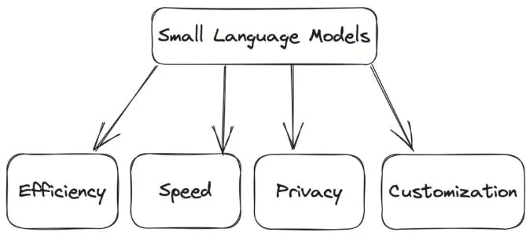
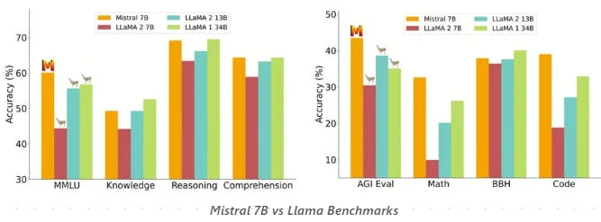
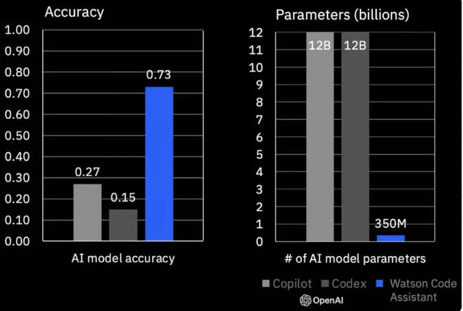

# The Emergence of Small Language Models

The emerging trend of Small Language Models (SLMs) in the business world and their growing importance alongside Large Language Models (LLMs).

## Understanding Large Language Models: A Refresher

- Foundation of Today's NLP: LLMs, trained on vast text data, excel in generating coherent text and performing complex language tasks.
- Size and Complexity: Models like GPT-3 (175 billion parameters) and PaLM (540 billion parameters) represent the massive scale of LLMs, offering advanced capabilities but sometimes leading to challenges in accuracy and behavior.

but LLMs are *very* expensive:

> running ChatGPT costs approximately $700,000 a day

## What are Small Language Models (SLMs)?

- Defining SLMs: Generally defined as models with up to 20 billion parameters, SLMs are tailored for specific business tasks like chat, analytics, and content generation.
- Agility and Customization: SLMs offer a balance of capability and control, making them well-suited for focused business applications.

## Advantages of SLMs

- Development and Risk Control: Easier to build and modify, SLMs reduce risks like bias and hallucinations due to simpler knowledge representations.
- Efficiency and Sustainability: Being lightweight and less computationally intensive, SLMs are ideal for deployment on smartphones and edge devices, contributing to sustainability.
- Cost-Effectiveness: SLMs offer significant cost savings, making AI more accessible for businesses.

> The speed of learning SLMs allow is huge, too. They're within the reach of so many more teams at lower cost. It just lets more innovation cycles happen faster - Brad Edwards

## Benchmarking SLMs Against LLMs

- Performance Comparisons: For instance, Mistral 7B outperforms larger models in certain benchmarks, demonstrating that SLMs can compete with or even surpass LLMs in specific tasks.

- Focused Training: SLMs like IBM Granite, despite smaller size and data, show competitive performance due to targeted training on industry-specific data.

## Tuning Small Language Models 

- Customization Techniques: Similar to LLMs, SLMs can be fine-tuned using various methods to enhance performance for specific use cases.
- Example of Tuning: IBM’s Granite series, for instance, underwent specialized training for coding, showing how SLMs can be tailored to specific domains.
 
## Use Cases of SLMs

- Versatile Applications: SLMs are effective in text generation, chatbots, Q&A, and summarization, offering optimized solutions for resource-limited scenarios.
- Domain-Specific Tuning: SLMs can be trained for specialized fields like medical, legal, or technical translation, offering more accurate and relevant outputs than general-purpose LLMs.

## In Summary

- Balancing Capability and Practicality: SLMs are emerging as a practical alternative to LLMs in many business scenarios, offering a mix of specialized capabilities and control.

SLMs represent a significant development in the AI landscape, providing businesses with more agile, cost-effective, and focused solutions for integrating AI into their operations.

[Next](./11-ai-engineer.md)