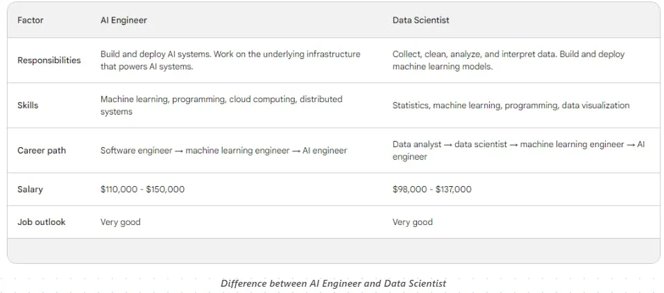

# The AI Engineer Profession and Skills

The evolving and dynamic role of AI Engineers in the rapidly advancing field of Generative AI.

## AI Engineering: A New Frontier

- Role Definition: AI Engineers are the architects behind practical AI applications, handling everything from the development to the deployment of AI systems.
- Emerging Importance: As AI capabilities grow, particularly with the advent of Foundation Models, AI Engineers have transitioned from niche specialists to key players in tech and business landscapes.

> I believe the AI Engineer will be the highest-demand engineering job of the decade.

## Responsibilities of AI Engineers

- AI Infrastructure: Develop and manage robust AI systems, ensuring scalability and efficiency.
- Advanced Prompting Strategies: Utilize tools like LangChain for sophisticated prompt engineering with LLMs
- Data Management and Model Operations: Master data preprocessing and embedding techniques, and manage a diverse range of language models for varied applications.
- AI Model Integration: Transform AI models into accessible APIs for seamless integration with software systems.

## Why AI Engineering is the Future

- Demand and Recognition: With AI integration becoming crucial for businesses, AI Engineers are in high demand for their ability to turn AI advancements into practical solutions.
- Diverse Backgrounds: Professionals in this field are proving that diverse backgrounds can contribute significantly to AI product development, beyond traditional academic pathways.

## The Path to Becoming an AI Engineer

- Foundational Skills: Master programming (Python), machine learning, deep learning, and cloud computing
- Recommended Courses: Consider enrolling in courses like IBM AI Engineering Professional Certificate or DeepLearning.ai's specialized courses in AI and LLM application development.
- Portfolio Development: Build a portfolio showcasing your AI projects to demonstrate your skills to potential employers.

Here's a good list of courses to start your AI Engineering journey: [link](https://www.linkedin.com/posts/armand-ruiz_7-short-courses-to-become-an-ai-engineer-activity-7122175917946245120-UVLO/?utm_source=share&utm_medium=member_desktop)​

## AI Engineer vs Data Scientist

- Role Distinction: Data scientists focus on data analysis and model building, while AI Engineers specialize in building and deploying AI systems and infrastructure.
- Unique Contribution: AI Engineers are pivotal in implementing large-scale AI systems, like LLMs, in practical, operational environments.

## The Future of AI Engineering

- Market Trends: The demand for AI Engineers is expected to surpass that of data scientists as the field continues to evolve towards more complex, large-scale AI implementations.
- Shaping the AI Landscape: AI Engineers are key to crafting strategies and architectures that will define the future of digital innovation, making this role not just current but increasingly vital in the AI-driven future.

AI Engineers stand at the forefront of the AI revolution, turning the promise of AI into tangible, valuable applications. This profession is not just about technical prowess; it's about shaping the future of how we interact with technology.

There are probably going to be significantly more AI Engineers than there are data scientists.

[Next](./12-ethics.md)