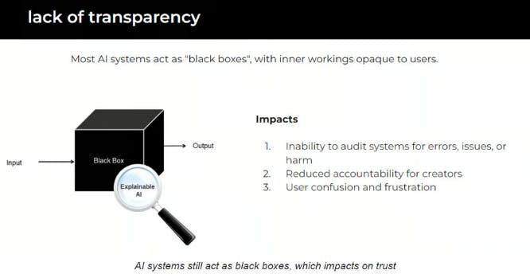
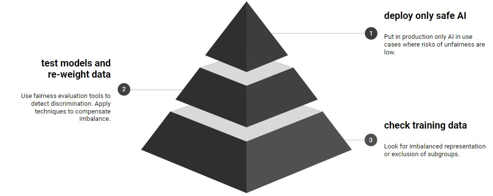
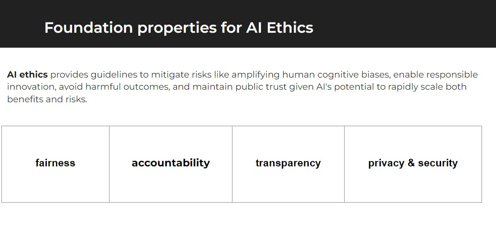

# Ethical Considerations in AI

Understand the ethical considerations in AI, particularly the risks and responsibilities associated with deploying these powerful technologies.

> AI is the most powerful technology ever created.

## Understanding the Risks of AI

- Bias, Fairness, and Accuracy: AI systems can inadvertently replicate human biases present in training data, leading to unfair and inaccurate outcomes. Continuous improvement in data and training practices is crucial to enhance AI fairness.
- Job Disruption: AI's potential to automate tasks poses challenges for the job market, necessitating re-skilling initiatives and policy responses.
- Weaponization: The integration of AI into weapons systems raises ethical concerns about autonomy in warfare and the need for international governance.
- Cybersecurity Vulnerabilities: AI systems can be exploited for adversarial attacks, data poisoning, and model hacking, underscoring the importance of robust cybersecurity measures.
- Misinformation Spread: AI's ability to generate convincing fake news requires vigilance and tools to detect and mitigate the spread of misinformation.
- Emergence of AGI: The prospect of Artificial General Intelligence (AGI) adds another layer of ethical complexity, with implications for the future of humanity.

> AI creating extinction risk for humanity is widely overhyped. AI develops gradually, and the “hard take off” scenario, where AI suddenly achieves superintelligence overnight is not realistic.

## The Role of AI Engineers in Mitigating Risks

- Infrastructure Development: AI Engineers are responsible for developing and managing AI infrastructure, ensuring systems are robust, scalable, and secure.
- Ethical Implementation: Part of their role involves applying ethical AI practices, such as prompt engineering and data management, to minimize risks like bias and inaccuracy.
- Collaboration and Best Practices: AI Engineers must collaborate across functions to promote AI best practices and ethical standards within their organizations.

## Mitigating Harmful AI Outputs

- Hallucinations and Fabrications: AI systems can generate plausible but incorrect content. It's essential to design systems that minimize these risks.
- Data Poisoning and Toxic Language: AI must be safeguarded against harmful data inputs and language generation, requiring ongoing model training and content filtering.
- Unstable Task Performance: Addressing the inconsistent performance of AI models involves careful prompt engineering and verification processes.
- Human Oversight: Incorporating human review in high-stakes AI applications provides an additional layer of safety and accuracy.

## The Path Forward: Ethical AI

- Balancing Act: The challenge lies in leveraging AI's potential while responsibly managing its risks and ethical implications.
- Responsible Deployment: Implementing safety checks, transparency measures, and human oversight is crucial for ethical AI deployment.
- Ongoing Education and Policy Development: Continuous learning and policy evolution are necessary to keep pace with AI advancements and ensure its beneficial use.

AI holds tremendous promise for transforming businesses and society. However, it's crucial to approach AI development and deployment with a keen awareness of its ethical implications, ensuring that these powerful tools are used responsibly and for the greater good.

[Next](./13-roadmap.md)

