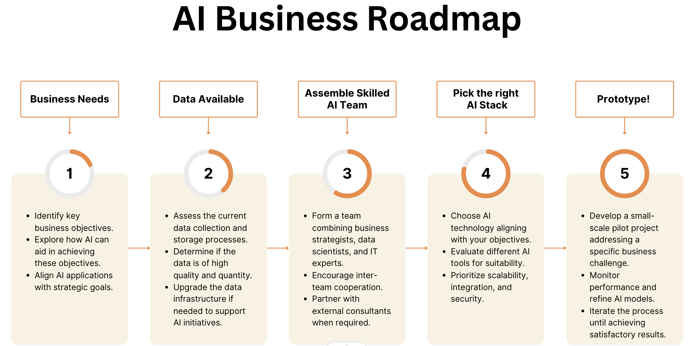

# Create Your AI for Business Roadmap

Plan AI in your business by creating an effective AI Business Roadmap. As leaders in your respective fields, the strategic integration of AI can be a transformative step for your organization, driving efficiency, innovation, and substantial growth.

## AI Business Roadmap: A Strategic Necessity

An AI Business Roadmap isn't just a technical layout; it's a comprehensive plan that aligns AI technologies with your specific business goals. This blueprint encompasses timelines, resources, and technical requirements, and addresses potential risks and human factors ensuring a smooth AI integration.

## Creating Your Roadmap: A Step-by-Step Guide

1. Identify Business Objectives: Understand how AI can help achieve your goals, whether it's through automation, predictive analytics, AI chatbots, or innovative product development.
2. Evaluate Data Infrastructure: AI needs quality data. Assess your data collection, storage, and cleanliness to ensure your AI initiatives can thrive.
3. Assemble a Skilled Team: Combine business insight, technical skills, and data science. Include business strategists, AI specialists, and IT professionals, or seek external expertise as necessary.
4. Choose Appropriate AI Technology: Select AI tools like ML, NLP, RPA, or Computer Vision, aligned with your business needs.
5. Prototype Development: Start small with a pilot project to address specific challenges, refining AI models based on performance.
6. Scale and Optimize: Expand successful prototypes, integrating them into broader business operations and continuously optimizing.
7. Implement Change Management: Develop strategies to assist your workforce in adapting to AI, including training and understanding AI benefits.

## High Impact, Low Effort AI Use Cases

Incorporate high-impact, low-effort AI applications such as AI chatbots for customer service, content generation, personalized marketing, predictive maintenance, routine task automation, fraud detection, demand forecasting, and streamlined recruitment. These use cases provide a strong foundation for your AI journey, ensuring meaningful returns with minimal initial effort.

[Next](./14-future-trends.md)