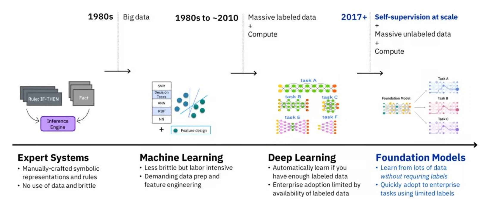
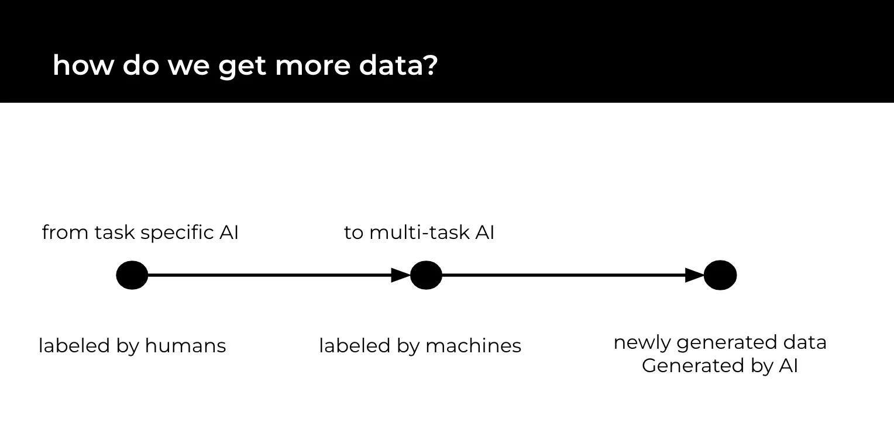
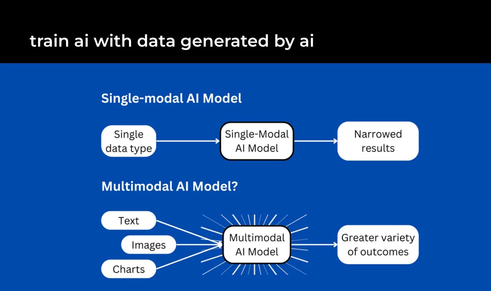
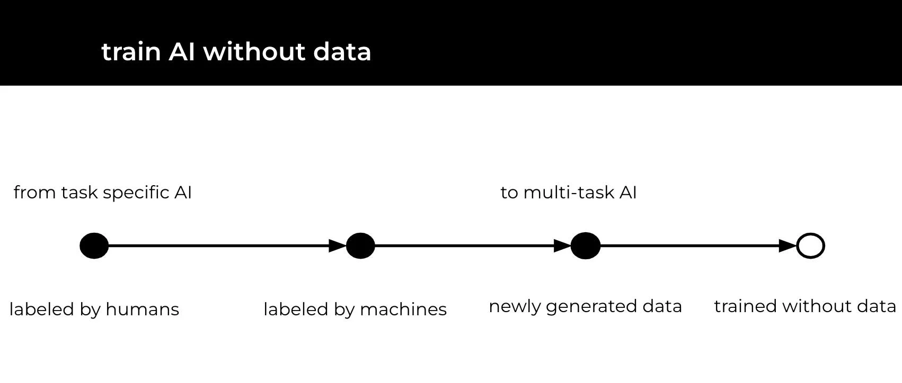

# Future Trends in AI

## Where Do We Come From?

Understanding AI's journey is key to predicting its future. The past decade laid the foundation for advancements in machine learning and neural networks. Now, we're poised to build on this legacy, driving AI towards more sophisticated and nuanced applications.

​

In **traditional machine learning**, individual siloed models require task-specific training and a significant amount of human-supervised learning. The limit on performance & capabilities for supervised learning are humans.

In contrast, **foundation models*** are massive multi-tasking systems, adaptable with little or no additional training, utilizing pre-trained, self-supervised learning techniques. The limit on performance & capabilities is mostly on computing and data access (not labeling).

## Synthetic Data

If the limit to a better model is more data, why don't create it artificially? The rise of synthetic data is a game-changer. It's about creating artificial datasets that can train AI without compromising privacy or relying on scarce real-world data. This innovation is set to revolutionize fields from healthcare to autonomous driving, making AI training more accessible, ethical, and comprehensive.

​

We will see increased usage of synthetic data because it overcomes data scarcity by allowing limitless generation, ensures balanced data distribution to avoid biases, and is cost-effective, bypassing the expensive and time-consuming process of real-world data collection and labeling.

## Multimodality

Multimodality is the future of AI's interaction with the world. By integrating text, image, sound, and more, AI can understand and respond to complex queries with unprecedented accuracy. This holistic approach will deepen AI's integration into daily life, from smarter virtual assistants to more intuitive educational tools.

## Reinforcement Learning

Want to take it to the next level? What if you could train the AI without data? Meet Reinforcement Learning, a technique poised to make significant strides. By learning through trial and error, AI systems will become more autonomous and capable of solving complex, real-world problems. This means smarter algorithms in everything from financial forecasting to climate change modeling.

Check out this video to see a demonstration of Reinforcement Learning in action:

[video preview](https://click.convertkit-mail2.com/n4upxv26kguquz7xxou6h7qg25gg/25h2hoh2347gmef3/aHR0cHM6Ly93d3cueW91dHViZS5jb20vd2F0Y2g_dj1rb3BvTHp2aDVqWQ==)​

## Giving Tools to AI

In the next decade, AI will evolve beyond being just a tool to becoming a creator of tools. We will see AI designing software, crafting algorithms, and contributing to AI research. AI agents will autonomously manage projects in a continuous loop, executing tasks, enhancing results, and generating new tasks based on objectives and past outcomes. Their workflow will include task execution, result enrichment, task creation, and prioritization. Equipped with integration capabilities, these agents will be able to search for information in CRMs, access databases, send emails, and more. Frameworks like BabyAGI and Auto-GPT are already emerging to test these concepts.

## Beyond Chats

While chatbots and conversational AI have made leaps, the future extends far beyond text. Expect AI that can seamlessly interact across various formats, offering richer, more immersive experiences. Whether it's in education, entertainment, or customer service, AI will engage us in more meaningful, dynamic ways.

