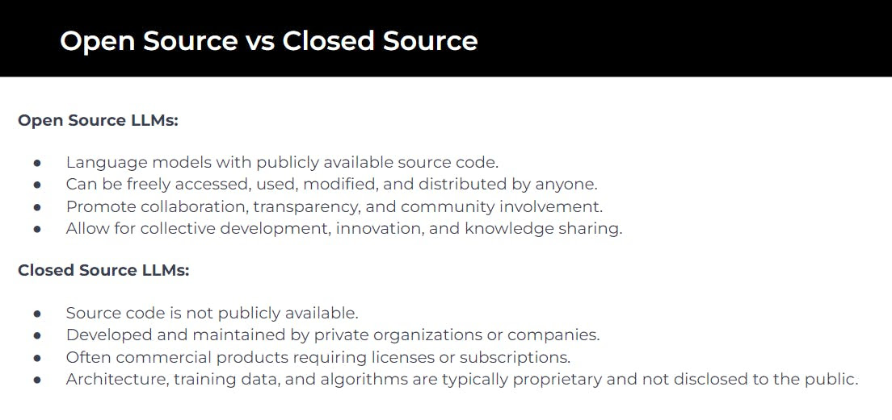

# The most popular LLMs available

Understand the key differences between open-source and proprietary models and services, and exploring some of the most popular LLMs available today.

## Open Source LLMs:

- Accessible and Collaborative: These models are freely available for use, modification, and distribution, promoting community-driven development and innovation.
- Examples of Open Source LLMs:
  - GPT-Neo/GPT-J: Developed by EleutherAI, these models are open-source alternatives to OpenAI's GPT models, offering similar capabilities.
  - BERT: Developed by Google, BERT has been a groundbreaking model for understanding context in natural language, widely used in various applications.

I listed the Top Open Source LLMs a few weeks back on Linkedin. Here's the [link](https://www.linkedin.com/posts/armand-ruiz_top-open-source-llms-available-for-commercial-activity-7137772625468002304-jkMM/?utm_source=share&utm_medium=member_desktop)​

## Closed Source LLMs:

- Commercial and Proprietary: These models are developed and maintained by private entities, often requiring licenses or subscriptions for access.
- Examples of Closed Source LLMs:
  - OpenAI's GPT-3/GPT-4: Known for their advanced capabilities, these models have set benchmarks in generative AI but are accessible mostly through API with usage costs.
  - Google's LaMDA: A cutting-edge model designed for conversational AI, used internally by Google.

## The Game Changer: Llama 2

- Accessibility and Versatility: Meta's Llama 2 has been released as an open-source AI model, making it accessible for everyone from startups to researchers. Its availability in different sizes (7B, 13B, 70B-parameter models) offers a range of options for fine-tuning and deployment.
- Innovation and Privacy: As an open-source model, Llama 2 removes barriers to AI adoption and addresses data privacy concerns by allowing private hosting and customization with your own data.
- Performance Benchmarking: Llama 2 stands on par with models like GPT-3.5 in terms of performance, particularly excelling in generating helpful responses for prompts. However, it shows less proficiency in coding tasks compared to other specialized models.
- Cost and Community Benefits: Meta’s open-sourcing of Llama 2, despite the substantial development cost, taps into the collective wisdom of the global AI community, accelerating innovation and potentially leveling the playing field against closed-source counterparts.

**Why the Distinction Matters**: Understanding the differences between open source and closed source LLMs is crucial for businesses and developers. Open source models offer transparency and the opportunity for customization, while closed source models, often backed by significant resources and research, provide robust, state-of-the-art capabilities but with usage restrictions and costs.

In your AI endeavors, choosing between open source and closed source LLMs will depend on your specific needs, resources, and goals.