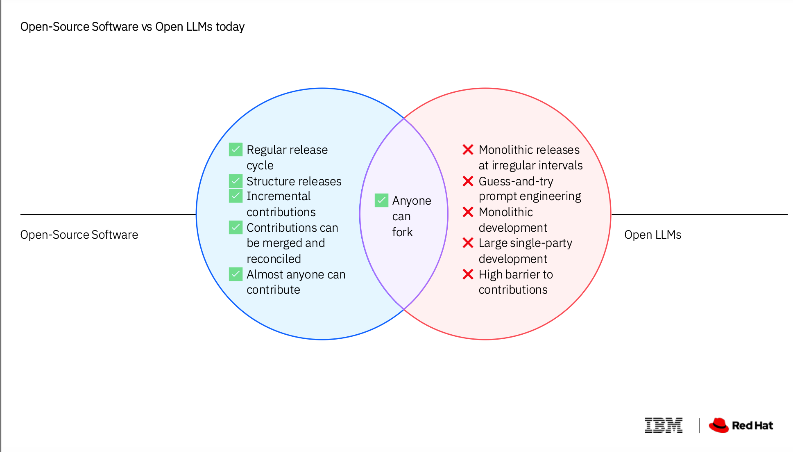
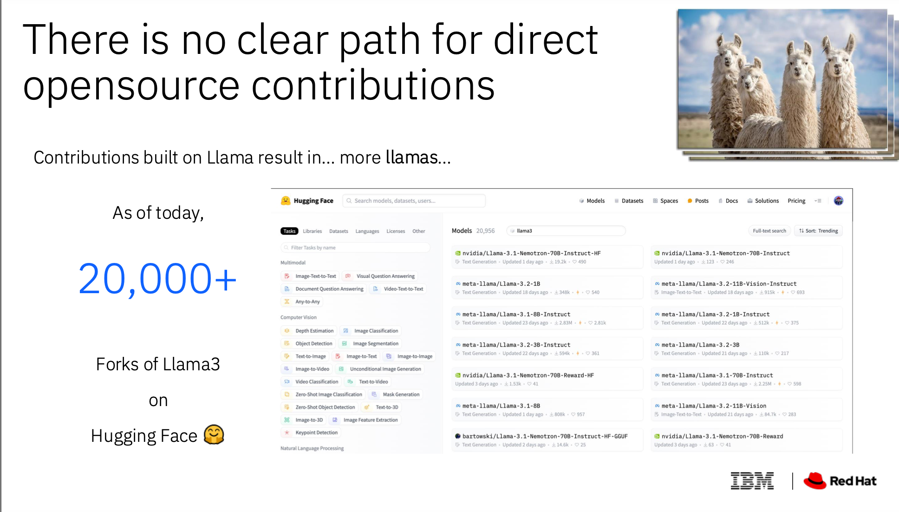
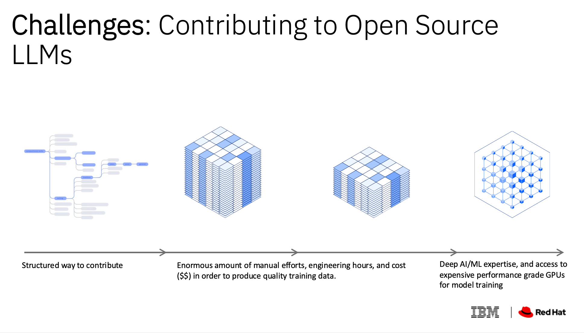
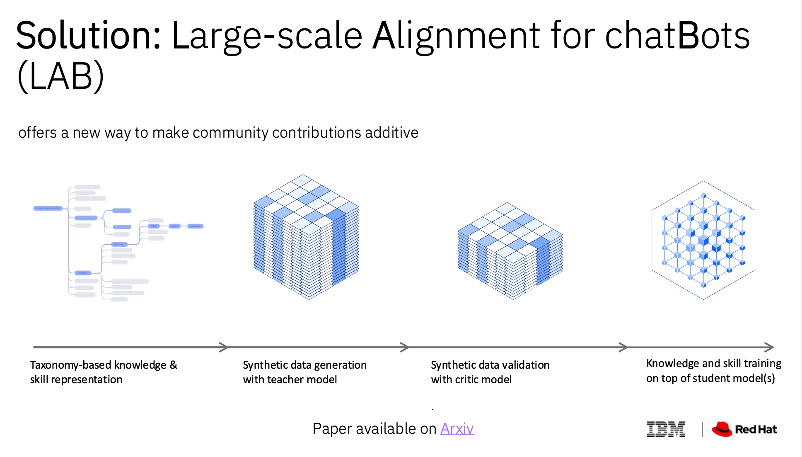
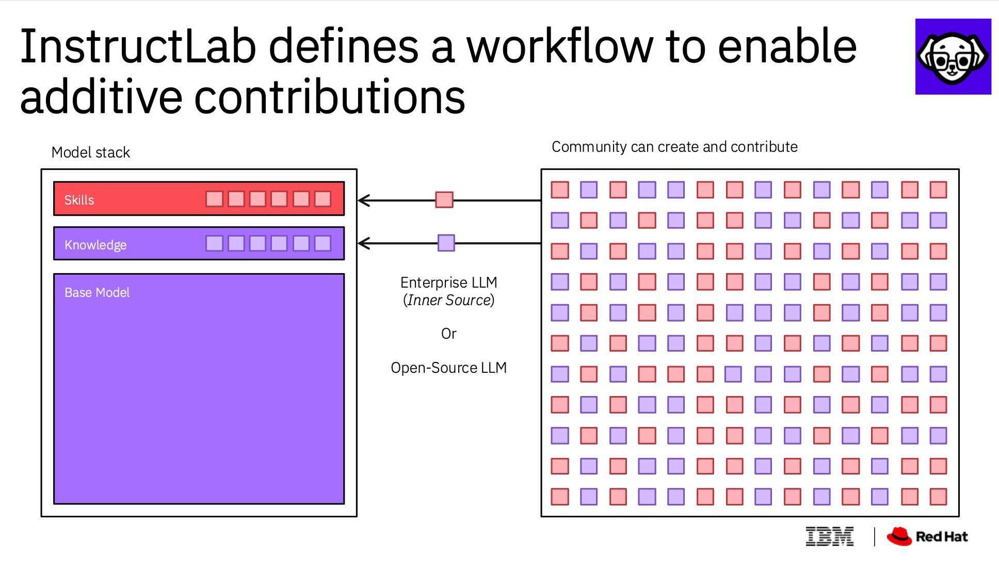

# Democratizing AI Models at Scale

## Large-scale Alignment for chatBots (LAB) Concepts
IBM’s new synthetic data generation method and phased-training protocol allows enterprises to update their Language Models with task-specific knowledge and skills, taking some of the guesswork out of training generative AI models.

IBM has a new solution: Large-scale Alignment for chatBots, or LAB. It’s a method for systematically generating synthetic data for the tasks you want your chatbot to accomplish, and for assimilating new knowledge and capabilities into the foundation model — without overwriting what the model has already learned. With LAB, Language Models can be drastically improved in far less time and at a lower cost than is typically spent training Language Models.

### Blog: [A faster, systematic way to train large language models for enterprise](https://research.ibm.com/blog/LLM-generated-data)
IBM’s new synthetic data generation method and phased-training protocol allows enterprises to update their LLMs with task-specific knowledge and skills, taking some of the guesswork out of training generative AI models.

IBM's Large-scale Alignment for chatBots (LAB) method revolutionizes chatbot training by systematically generating high-quality synthetic instruction data. Unlike traditional methods relying on costly human-generated data or limited synthetic datasets, LAB employs a structured taxonomy to define, map, and enhance chatbot knowledge and skills. This taxonomy organizes data into three categories: knowledge, foundational skills, and compositional skills, enabling developers to identify gaps and fill them efficiently.

A "teacher model" generates tailored instructions, iteratively conducting quality checks to ensure accuracy. The instructions are then used in a phased training approach: simple concepts first, followed by complex, task-specific skills. This gradual learning process mirrors human knowledge acquisition and prevents the model from overwriting prior training.

IBM tested LAB by generating 1.2 million synthetic instructions to train two open-source models, Labradorite 13B and Merlinite 7B, which outperformed state-of-the-art chatbots like Microsoft’s Orca-2. LAB also enhanced IBM's enterprise-focused Granite models.

The method's unique traits include targeted synthetic data generation and the ability to incorporate new knowledge without retraining the teacher model. This makes LAB cost-effective, scalable, and legal for enterprises wary of proprietary LLMs. LAB empowers smaller, open-source models to rival industry giants, democratizing advanced chatbot capabilities.

## How InstructLab’s synthetic data generation enhances LLMs
InstructLab addresses several challenges faced by developers, such as the complexity of contributing to language models, the issue of model sprawl caused by forked models and the lack of direct community governance.

### Blog: [How InstructLab’s synthetic data generation enhances LLMs](https://www.redhat.com/en/blog/how-instructlabs-synthetic-data-generation-enhances-llms)
InstructLab tackles the inefficiencies of large language model (LLM) development by focusing on high-quality synthetic data generation rather than sheer data quantity. Traditional LLM training relies on vast datasets, such as Common Crawl, which often include redundant or low-quality information, leading to inefficient computational resource usage and high costs. Instead, InstructLab employs the Large-scale Alignment for chatBots (LAB) methodology to generate synthetic data from minimal human-curated examples, significantly reducing manual effort and computational overhead.

A key innovation in InstructLab is its taxonomy-driven approach, which organizes skills and knowledge hierarchically. This structure helps identify gaps in a model’s capabilities and curates relevant data in question-and-answer pairs using YAML files. A "teacher model" expands the dataset by generating examples that retain the structure and intent of the seed data, ensuring precision and relevance.

The LAB methodology employs two generators: the Skills Synthetic Data Generator (Skills-SDG) and the Knowledge-SDG. Together, they enable the creation of vast datasets while maintaining quality through automated refinement processes, including content filtering and evaluation. The iterative process continually improves the model, preventing knowledge loss through techniques like replay buffers.

InstructLab uses a multiphase tuning framework to enhance performance incrementally. Initial training integrates foundational knowledge, while later phases develop task-specific skills. Benchmarks show LAB-trained models like Labradorite-13b and Merlinite-7B outperform traditional models on multitask understanding, reasoning, and inference tests.

By democratizing LLM development with open-source tools and community contributions, InstructLab fosters collaboration and makes advanced AI accessible to a broader audience. Its ability to generate precise, high-quality data offers a scalable, cost-effective alternative to traditional LLM training, providing tailored solutions for specific applications while minimizing computational demands.

## Why developers need InstructLab?
Large Language Models (LLMs) have the ability to fuel a diverse array of practical applications, like having a virtual assistant that can chat with you, help you with coding, or even generate content for your next marketing email. That’s the power of LLMs.

Sure, it’s impressive to see these models effortlessly generate coherent text or provide insightful responses and offer insightful solutions to business challenges. But here’s the catch: While LLMs offer a plethora of possibilities, there are boundaries to what they can and can’t do. The real complexity lies beneath the surface in the intricate web of computations required to bring these models to life for specific business needs.

AI practitioners often find themselves needing to tweak pre-trained Language Models to fit specific business needs, but there are limits to customizing these models. 

Fine-tuning pretrained Language Models on downstream data sets does lead to significant performance improvements compared to using them out-of-the-box (for example, in zero-shot inference). However, this process presents challenges such as being time-consuming, needing high quality data, and being computationally expensive.

As Language Models continue to grow in size, the feasibility of fully customizing them on consumer hardware becomes increasingly difficult. Additionally, the cost of storing and deploying fine-tuned models independently for each downstream task becomes super expensive, as these models maintain the same size as the original retrained model. And Language Model refinements typically require large amounts of human-generated data, which can be time-consuming and again expensive.

This is where InstructLab steps in. It provides a solution to the challenges faced by AI practitioners in fine-tuning and deploying Language Models for specific business needs. InstructLab takes a different approach to overcome these limitations.

[Blog: What is InstructLab and why do developers need it?](https://developer.ibm.com/articles/awb-instructlab-why-developers-need-it/)

## Open Source Community Instruction-tuning of Language Models
[B J Hargrave](https://www.youtube.com/watch?v=l-Nq2b8Y-mA)
As a developer, imagine what you can do if Language Model tuning can be extended with contributions from across the wider community. Let’s think about a scenario where a developer found an open source Language Model on Hugging Face. Out of the 100s of thousands of Language Models available on Hugging Face, typically, if you (developer or AI Engineer) would like to contribute a change to an open Language Model, the only way to do so is by publishing yet another fork of the model. This results in multiple different  forks and no single version of the model available that incorporates all  changes done by the wider community.

## How Open Source  can democratize AI
[Malcolm Gladwell (Journalist) and Máirín Duffy at Red Hat.](https://www.youtube.com/watch?v=SkXgG6ksKTA)
Once you know you can run it on a laptop, you have democratized it. Future goals like private AI for peoples that don't have access to GPs.

Future of business application using private, small models tuned on your own data.

## The future of AI is open
- less than 1% of enterprise data has made it into AI models
- IBM Granite training for COBOL to Java translation took 9 months, 14 rounds of fine-tuning
- Using InstructLab team added new COBOL skills in a week, 1 round to achieve better performance

According to Gil, just about every single piece of publicly available data has already been incorporated into training data for AI foundation models in use today. But he estimated that less than 1% of enterprise data has made it into AI models. Much of their data is also not currently in formats or places that make feeding it into models easy. To address this gap, IBM is making foundation models open and collaborative, helping businesses to capitalize on their data and trust the results.

To this end, IBM and Red Hat launched InstructLab. InstructLab enables foundation models to learn incrementally, more like humans do. InstructLab gives anyone tools to feed a model with new data and create new capabilities and skills in the model, without the need to retrain the model from scratch. IBM enabled its Granite language model for InstructLab, allowing anyone to contribute new skills and knowledge.

With InstructLab, this whole process can happen quickly and transparently, with lower computing costs. To show how much quicker models can be fine-tuned, Gil said that when IBM’s Granite code models were being trained on translating COBOL to Java, they had 14 rounds of fine-tuning that took nine months. Using InstructLab, the team added newly fine-tuned COBOL skills in a week, requiring only one round of tuning to achieve better performance.

## InstructLab: a new way to collaboratively customize LLMs (10 Steps)

- install InstructLab
- fork the taxonomy
- chat with original model
- add knowledges as Markdown on GitHub
- update the taxonomy
- generate synthetic data
- train the model
- quantize the model (to run on laptop)
- chat with the new model
- contribute back into InstructLab

## Tutorials
- [Contributing knowledge to the open source Granite model using InstructLab](https://developer.ibm.com/tutorials/awb-contributing-knowledge-instructlab-granite/)
- [Contributing knowledge to open-source LLMs like the Granite models using the InstructLab UI](https://developer.ibm.com/tutorials/awb-contributing-llm-granite-instructlab-ui/)

InstructLab
- trained models are published to Hugging Face
- Mistral-7B is the default teacher model
- GitHub account needed for InstructLab UI

## Social media summary
InstructLab is true open-source approach to fine-tuning LLMs. It democratizes AI by making fine-tuning possible on a laptop - promoting access and availability to all with less compute resource.

It has a syntentic data generation and training process so that individuals and enterprises can fine-tune models with their own data.

It has an open-source process where new skills and knowledge can be contributed back to the models. Not the current open LLM approach which leads to multiple fine-tuned forks of open source models.

You can prove intial results with training and evaluation on a laptop. This allows for fast iteration in the path to productionising models on private data.

