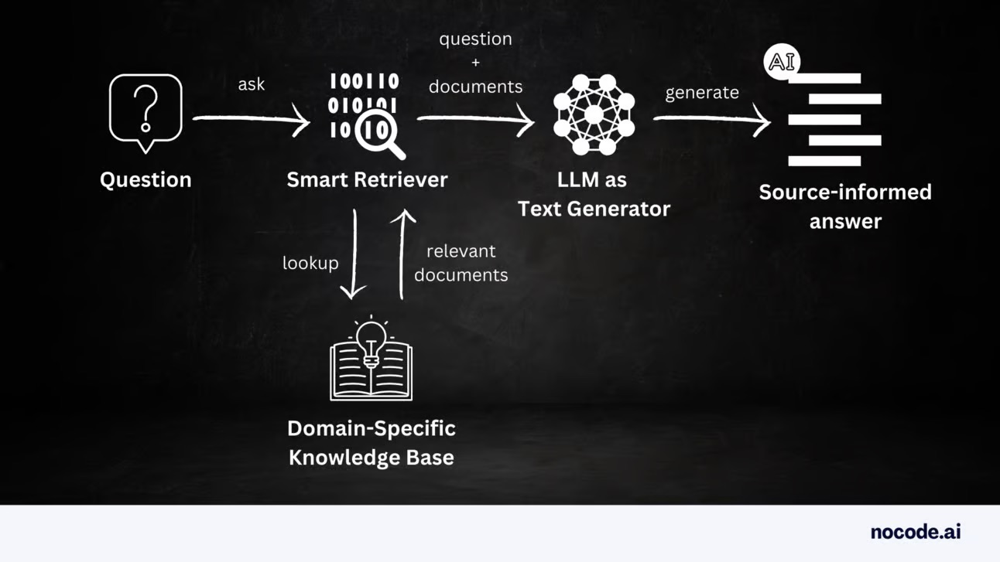
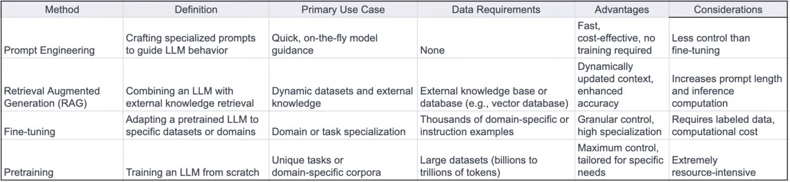
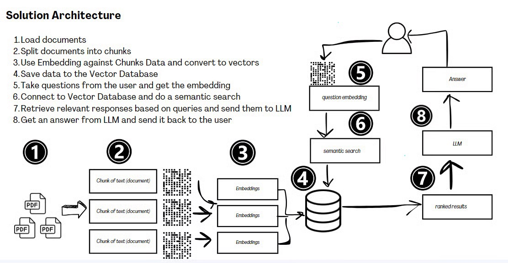
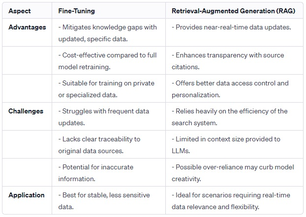

# Retrieval-Augmented Generation (RAG) 

Retrieval-Augmented Generation (RAG)  represents a significant evolution in the field of AI, particularly in enhancing the capabilities of large language models (LLMs). In today’s guide, I’ll provide a deep dive into the RAG essentials, exploring its functionality, importance, operational mechanisms, and best practices for implementation.

Today I'll cover:
- What is exactly RAG
- How it works
- Business use cases for RAG
- The advantages of utilizing RAG
- Recommended architectural framework
- RAG vs Fine-Tune
- A step-by-step implementation tutorial

## What is Retrieval Augmented Generation (RAG)?

Retrieval-augmented generation is an AI framework that integrates LLMs with external knowledge sources. This synergy allows LLMs to supplement their internal information with facts retrieved from an external knowledge base, such as customer records, dialogue paragraphs, product specifications, and even audio content. By utilizing this external context, LLMs can generate more informed and accurate responses.

> Human work will shift from performing numerous manual look-ups and information gathering to directing teams of Large Language Models (LLMs) and synthesizing the results.
Enterprises will employ 100-1000s of these AI assistants across every job function.

### Why is RAG Important?

RAG addresses several critical challenges faced by LLMs:

- **Knowledge Cutoff**: LLMs are limited by their training data. RAG provides access to external, up-to-date knowledge, enabling more accurate responses.
- **Hallucination Risks**: LLMs may produce factually inaccurate responses. RAG supplements LLMs with external information, reducing such risks.
- **Contextual Limitations**: LLMs often lack context from private data, leading to inaccuracies. RAG provides relevant, domain-specific data, ensuring more informed responses.
- **Auditability**: By citing sources, RAG improves the auditability of responses generated by GenAI applications.

## How RAG Works

RAG operates in two distinct phases:
1. **Retrieval Phase**: Algorithms search and retrieve snippets of information relevant to the user's prompt from various data sources like document repositories, databases, or APIs.
2. **Content Generation Phase**: The retrieved context is provided as input to a generator model, typically an LLM. This model uses the context to generate text output grounded in relevant facts and knowledge.

To ensure compatibility, document collections, and user queries are converted to numerical representations using embedding language models. The RAG architecture then compares these embeddings, augmenting the original user prompt with relevant context before sending it to the foundation model.

## Business use cases for RAG

RAG technology has found many practical applications across various business sectors:

- Enhanced Search Outcomes: In healthcare, RAG improves the examination of Electronic Medical Records (EMRs) and the findings of clinical trials.
- Interactive Data Conversations: RAG simplifies complex data interactions, allowing non-technical stakeholders to query databases directly using natural language.
- Advanced Customer Support Chatbots: In industries like IT and manufacturing, RAG-equipped chatbots provide precise responses to customer inquiries.
- Summarization for Efficiency: In education, RAG streamlines the process of grading essays or creating condensed study materials.
- Data-Driven Decision Making: In finance and legal sectors, RAG assists in drafting contracts and condensing regulatory documents.

## The advantages of utilizing RAG

There are many benefits of employing RAG in business contexts. First and foremost, it significantly enhances the accuracy and relevance of AI-generated content. This leads to improved customer satisfaction, as responses are more tailored and informative. Furthermore, RAG can streamline operations, reducing the time and resources spent on content generation and data retrieval tasks.

### Advantages
- Cost-effective Training: RAG requires less computational power and data compared to extensive fine-tuning or training LLM processes.
- Access to Various Knowledge Sources: RAG combines internal knowledge with that from external databases, resulting in more accurate answers.
- Enhanced Scalability: RAG can handle large datasets and intricate queries, surpassing conventional LLMs limited by their context window size.

### Challenges
- Risk of Hallucinations: RAG can still make errors if the database lacks certain information.
- Managing Scalability: Increasing the database size can complicate quick and efficient data retrieval.
- Potential Biases: Biases in the retrieval database can influence the responses, necessitating tools to identify and mitigate these biases.

## The Generative AI Maturity curve

Before LLMs, ML development was linear. Teams needed months of tedious data collection, feature engineering, and multiple training runs, as well as a team of PhDs before the system could be produced as a customer-facing end product.

The table below summarizes key methods in LLM development, outlining their definitions, use cases, data requirements, advantages, and considerations for your business applications. It covers Prompt Engineering, Retrieval Augmented Generation (RAG), Fine-tuning, and Pretraining.

Each of these techniques shows different stages of complexity and compute-intensiveness. What’s cool about RAG is that it is very cost-efficient, and when implemented properly, the results can be excellent.

## Recommended Architectural Framework

Adopting RAG requires a thoughtful architectural approach. The blueprint suggests a framework that seamlessly integrates the retrieval and generative components. This includes robust databases, efficient indexing mechanisms for quick data retrieval, and a generative model that can effectively utilize the retrieved data. Ensuring smooth interoperability between these components is key to harnessing the full potential of RAG.

Components required in a RAG architecture:

1. Knowledge Base: Think of this as RAG's library, filled with all sorts of information from documents, databases, or even APIs. It's like a treasure trove of knowledge for RAG to use.
2. User Query: This is where you come in. You ask a question or make a request, and RAG starts its magic.
3. Retrieval Model:
- Embedding Model: This part turns the text from your question and the information in the knowledge base into numbers. It's like translating languages, but instead, it translates words into a form that the system can understand and compare.
- Search Engine: Armed with these numerical translations, RAG then searches through its library to find the most relevant information. It's like having a super-efficient librarian at your service.
4. Generation Model:
- Large Language Model (LLM): This is where RAG gets creative. It uses advanced text generation models (think of them as super-smart writing tools) like GPT-3 to craft a response that's both informative and easy to understand.
5. Integration and Orchestration:
- Prompt Engineering: This is a bit like scriptwriting for RAG. It takes the information found and mixes it with your original question to set the scene for the LLM.
- Model Serving: This is the backstage crew, making sure RAG gets your question and sends back the right answer.
6. Extra Bits:
- Monitoring and Logging: Keeps an eye on RAG to make sure it's doing its job right.
- User Interface: This is where you interact with RAG, like in a chatbot or search engine.

A key component of the architecture is the Vector Database. It is used to store high-dimensional embeddings of text documents. Its primary role is to enable fast and efficient retrieval of information that is semantically similar to a given query. This retrieval is crucial for the RAG model to generate accurate and contextually relevant responses. The vector database ensures scalability, speed, and continuous updating of information, enhancing the overall performance of the RAG system.

## The Grand Dilemma: RAG vs Fine-Tune

The debate in Generative AI often revolves around choosing between RAG and fine-tuning LLMs. This choice is influenced by the need for domain-specificity and the rate of data change.

I have put together a table to guide you through the decision-making process.

Blending fine-tuning and RAG could leverage their respective strengths, using fine-tuning for stable, less sensitive data, and RAG for real-time data relevance and flexibility. This combination could offer a comprehensive solution in advanced Generative AI applications.

>From my hands-on experience, it's clear: around 60% of current use cases are swiftly embracing the RAG approach, marking a transformative shift in practical AI application.

## A step-by-step RAG tutorial

Let's get hands-on with the keyboard and try a simple RAG implementation ourselves. So much valuable information is trapped in PDFs and documents. In today's tutorial, we will build a chat interface that allows direct interaction with information in PDFs. We will complete the following steps:

1. Load documents
2. Split documents into chunks
3. Use Embedding against Chunks Data and convert to vectors
4. Save data to the Vector Database
5. Take data (question) from the user and get the embedding
6. Connect to Vector Database and do a semantic search
7. Retrieve relevant responses based on user queries and send them to LLM
8. Get an answer from LLM and send it back to the user

Watch the video tutorial: [link](https://flight.beehiiv.net/v2/clicks/eyJhbGciOiJIUzI1NiIsInR5cCI6IkpXVCJ9.eyJ1cmwiOiJodHRwczovL3d3dy5sb29tLmNvbS9zaGFyZS9kMzE5YjRhMzYxMDM0MmI3YWYxOWZlY2IyMmNmODg0Mz9zaWQ9OTg3YjI1NDMtODAxZC00NjE5LWI2ZWMtZjI3NGE0NmE3Y2EzJnV0bV9zb3VyY2U9bmV3c2xldHRlci5ub2NvZGUuYWkmdXRtX21lZGl1bT1yZWZlcnJhbCZ1dG1fY2FtcGFpZ249YS1ndWlkZS10by1yZXRyaWV2YWwtYXVnbWVudGVkLWdlbmVyYXRpb24iLCJwb3N0X2lkIjoiYjcyZGJhYTctNmE3MS00MDViLWEwNzMtNWFlZmRhMGNhZWM0IiwicHVibGljYXRpb25faWQiOiIzYTM1MTRjMy1kM2ZmLTQ2OGMtODI1Yy04NWM0OTU0M2QwZjEiLCJ2aXNpdF90b2tlbiI6ImNjYWQ5ZDRjLTZkNmYtNDNiMi04Zjk1LTA0ODI4OTFjYTg2MSIsImlhdCI6MTcwNzM0MzA4NiwiaXNzIjoib3JjaGlkIn0.pWMy4_2dHXe5X0B9jcMqBI1IZkBmqWoOEJNzcrSEZt8)

Do you prefer step-by-step written instructions? You can access them here: [link](https://newsletter.nocode.ai/p/tutorial-chat-documents)

## Conclusion
RAG is transforming the landscape of AI by enabling LLMs to generate responses that are not only accurate but also rich in context and relevancy.

Its applications span various domains, from chatbots to customer service, providing solutions that are both reliable and informed.

By adopting RAG and adhering to best practices in its implementation, businesses and developers can significantly enhance the capabilities of their AI-driven applications, ensuring they remain at the forefront of technological innovation.

[Source](https://newsletter.nocode.ai/p/guide-retrieval-augmented-generation)

